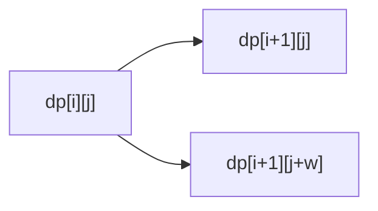
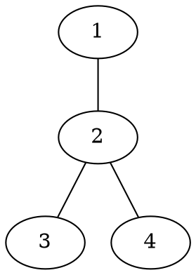

# OJ 题目解析格式规范

这个 skill 只负责 `problems/` 下题目解析文章的写作格式和 Markdown 骨架。

它不负责：

- 推导题目解法。
- 判断算法是否正确。
- 讲解双指针、DP、图论等算法内容。
- 重写已有正文的题目解析。
- 判断 `tags` 和 `categories` 的具体算法标签是否准确。
- 判断或维护题目之间的 `pre` / `common` 关系。

算法解析内容由另一个题目解析 skill 填写。本 skill 只保证文章结构稳定、字段完整、代码嵌入格式统一。
题目关系元数据由 `oj-problem-relation-writer` 维护。

注意：最终题目解析允许在 `### 思路` 中嵌入 `brute.cpp`，作为帮助读者理解题意和朴素做法的代码；正式提交代码仍固定放在 `### 代码` 中并引用 `main.cpp`。

## 使用 Grill-Me

如果用户要求先 `grill me`，按这个顺序一次只问一个问题，并给推荐答案：

1. 这个 skill 是否只管格式、不管解析内容？
2. 是否使用固定章节标题？
3. 是否强制最小 frontmatter 字段？
4. 是否统一使用 `@include-code(...)` 嵌入代码？
5. 是否允许在 `### 思路` 中嵌入 `@include-code(./brute.cpp, cpp)` 辅助理解？
6. 空章节是否使用 HTML 注释占位？
7. 是否负责文件命名和存放路径？
8. 修改已有题解时，是强制套模板还是只修正格式？
9. 是否把 Mermaid、Graphviz、二维表格等可视化内容纳入格式规范？

能从本仓库已有文件判断的问题，不要问用户。

## 文件位置

只使用目录型题目结构。新建题解放在：

```text
problems/<oj>/<problem_id>/index.md
```

对应代码固定为：

```text
problems/<oj>/<problem_id>/main.cpp
```

示例：

```text
problems/luogu/1001/index.md
problems/luogu/1001/main.cpp
```

过程文档目录为：

```text
problems/<oj>/<problem_id>/problem-analysis-workspace/
```

不要新建或输出旧扁平结构，例如 `problems/poj/poj3061.md` 和 `problems/poj/poj3061.cpp`。

## Frontmatter

每篇题解 Markdown 必须以 YAML frontmatter 开头。

字段顺序固定为：

```yaml
---
oj: "poj"
problem_id: "3061"
title: "Subsequence"
date: 2025-11-28 15:41
toc: true
tags: []
categories: []
pre: []
common: []
source: https://vjudge.net/problem/POJ-3061
---
```

字段规则：

- `oj`：小写 OJ 名称，通常来自目录名。
- `problem_id`：字符串格式。
- `title`：题目标题；不知道时使用空字符串，不编造。
- `date`：新建文章使用当前本地时间；修改旧文时保留原日期。
- `toc`：固定为 `true`。
- `tags`：数组格式；本 skill 不负责填具体算法标签。
- `categories`：数组格式；本 skill 不负责填具体分类。
- `pre`：数组格式，表示当前题的前置题；本 skill 不负责判断具体关系。
- `common`：数组格式，表示和当前题相似的题；本 skill 不负责判断具体关系。
- `source`：题目来源；不知道时留空，不编造。

`pre` / `common` 的元素格式由 `oj-problem-relation-writer` 维护：

```yaml
pre:
  - oj: "luogu"
    problem_id: "P1002"
    reason: "网格路径计数 DP 的基础版本"
common:
  - oj: "luogu"
    problem_id: "P1002"
    reason: "同样是带限制的网格 DP"
```

关系字段是可选扩展字段。修改已有文件时，如果原文件没有 `pre` / `common`，本格式 skill 不强制补充；如果已经存在，则按标准顺序保留在 `categories` 后、`source` 前。

修改已有文件时：

- 保留已有有效字段值。
- 补齐缺失字段。
- 按标准顺序整理字段。
- 不因为不知道内容而删除原有字段值。

## 固定章节

frontmatter 后必须有：

```markdown
[[TOC]]
```

正文固定使用这些三级标题：

```markdown
### 题意

### 思路

### 代码

### 复杂度

### 总结
```

不要在题解正文中添加一级标题或二级标题。题目标题由 frontmatter 的 `title` 提供。

## 可视化辅助格式

题解允许使用图形化内容辅助理解，但本 skill 只规定格式，不判断具体题目是否需要图。

允许的可视化形式：

- Markdown 表格：用于 DP 表、背包表、样例推演、状态变化。
- Mermaid：用于流程图、状态图、简单树形结构、样例过程。
- Graphviz dot：用于图论样例图、树、DAG、拓扑关系。
- `tree_draw.py` 生成的 SVG：用于普通树、二叉树、线段树、静态树形数据结构图。
- 图片：用于 Graphviz 离线生成图、手绘标注图或复杂结构图。

可视化内容放置规则：

- 如果图只解释样例，放在 `### 题意` 中样例解释附近。
- 如果图解释算法本质，放在 `### 思路` 中关键观察或转移推导附近。
- 不新增二级标题；如需分段，使用四级标题，例如 `#### 样例图`、`#### DP 表格`。
- 不为了装饰添加图。每张图或表都必须有明确教学目标。

每个可视化块必须满足：

- 图前用 1 句话说明“这张图展示什么”。
- 图后用 2 到 5 句话说明“读者应该看什么”。
- 表格必须解释行、列、单元格含义。
- Mermaid / Graphviz 源码块内部尽量使用 ASCII 节点 ID；中文放在 label 或说明文字中。
- 普通题解最多 1 到 2 个可视化块；难题最多 3 个。
- 图超过 30 个节点、DP 表超过 `10 x 10`、搜索树超过 3 层时，只展示关键局部。
- 树形 SVG 推荐命名为 `tree.svg`、`binary-tree.svg`、`segment-tree.svg` 或能表达内容的短横线文件名。
- 题解中插入本地 SVG 时使用标准 Markdown 图片语法，例如 ``。

Mermaid 示例：

````markdown
#### 状态转移图

这张图展示从一个状态可以转移到哪些后继状态：



从图中可以看到，每个物品只有“不选”和“选”两种去向。
这正好对应 0/1 背包的一次状态转移。
````

Graphviz 示例：

````markdown
#### 样例图

这张图把样例中的边画成无向图：



tree_draw.py 示例：

```markdown
#### 样例树

这张图把样例中的父子关系画成树：


根节点是 `1`，它有两个直接孩子 `2` 和 `3`。
后面分析 DFS 顺序时，可以先观察每棵子树的进入顺序。
```

节点 `2` 是这个样例中的分叉点。
后面分析 DFS 顺序时，可以先盯住从 `2` 出发的几条边。
````

DP 表格示例：

```markdown
#### DP 表格

这张表展示样例中前两层状态的变化：

| i \ j | 0 | 1 | 2 |
| --- | --- | --- | --- |
| 0 | 1 | 0 | 0 |
| 1 | 1 | 1 | 0 |

行表示已经处理到第 `i` 个元素。
列表示当前容量或状态值 `j`。
单元格中的值是 `dp[i][j]`。
```

## 占位注释

如果某个章节暂时没有正文，保留章节，并使用 HTML 注释占位：

```markdown
<!-- 由题目解析 skill 填写 -->
```

占位注释用于多 skill 协作，不会显示在电子书正文中。

不要使用可见文本占位，例如：

```markdown
待补充
TODO
这里写思路
```

## 代码嵌入

正式代码章节统一使用：

```markdown
@include-code(./main.cpp, cpp)
```

规则：

- 路径必须相对当前 Markdown 文件。
- `### 代码` 固定引用同目录 `main.cpp`。
- 不在 Markdown 中粘贴完整代码。
- 如果暂时没有代码文件，保留代码章节，并使用 HTML 注释说明：

```markdown
<!-- 缺少对应代码文件 -->
```

`### 思路` 中可以嵌入朴素解：

```markdown
先看一个可以直接验证想法的朴素解：

@include-code(./brute.cpp, cpp)
```

规则：

- `brute.cpp` 用于解释朴素想法和辅助对拍。
- `brute.cpp` 不替代 `main.cpp`。
- `brute.cpp` 不放在 `### 代码` 中。
- 如果只是格式修正且缺少 `brute.cpp`，可以先保留 HTML 注释；真正写题目解析时由 `oj-problem-analysis-writer` 完成 `brute.cpp`。

## 新建文章模板

新建题解骨架时，直接使用这个模板：

```markdown
---
oj: ""
problem_id: ""
title: ""
date: YYYY-MM-DD HH:mm
toc: true
tags: []
categories: []
source:
---

[[TOC]]

### 题意

<!-- 由题目解析 skill 填写 -->

### 思路

先看一个可以直接验证想法的朴素解：

@include-code(./brute.cpp, cpp)

<!-- 由题目解析 skill 填写 -->

### 代码

@include-code(./main.cpp, cpp)

### 复杂度

<!-- 由题目解析 skill 填写 -->

### 总结

<!-- 由题目解析 skill 填写 -->
```

填充模板时，只填能从文件名、路径、已有元数据或用户明确输入中确定的字段。不要为补全模板而编造信息。

## 修改已有题解

修改已有题解时，只修正格式问题，尽量保留已有正文。

可以做：

- 补齐 frontmatter。
- 调整 frontmatter 字段顺序。
- 补上 `[[TOC]]`。
- 将明显的章节标题统一为固定标题。
- 补缺失章节。
- 将完整代码块替换为 `@include-code(...)`，前提是对应代码文件存在。
- 在 `### 思路` 中保留或补充 `@include-code(./brute.cpp, cpp)`，用于朴素解说明。
- 为缺失内容添加 HTML 注释占位。

不要做：

- 重写算法思路。
- 删除已有题目解析正文。
- 改变正文中的算法结论。
- 重新判断复杂度。
- 修改 `tags`、`categories` 的具体内容，除非用户明确要求或只是整理数组格式。
- 判断或修改 `pre`、`common` 的具体关系，除非用户明确要求或只是整理数组格式。
- 强制把已有可读正文改成模板化空骨架。

## 输出检查清单

交付前检查：

- Markdown 文件位于 `problems/<oj>/<problem_id>/index.md`。
- frontmatter 在文件最开头。
- frontmatter 包含 `oj`、`problem_id`、`title`、`date`、`toc`、`tags`、`categories`、`source`。
- 如果存在 `pre` / `common`，它们位于 `categories` 后、`source` 前，且为数组格式。
- frontmatter 字段顺序符合规范。
- frontmatter 后有 `[[TOC]]`。
- 正文包含 `### 题意`、`### 思路`、`### 代码`、`### 复杂度`、`### 总结`。
- 空章节使用 HTML 注释占位。
- `### 思路` 可以使用 `@include-code(./brute.cpp, cpp)` 说明朴素解。
- `### 代码` 使用 `@include-code(./main.cpp, cpp)` 或缺失代码注释。
- 没有粘贴完整代码。
- 没有编造题目标题、来源、算法标签或解析内容。

## 最终回复

完成修改后，只简短说明：

- 修改了哪个文件。
- 执行的是新建骨架还是格式修正。
- 是否保留了已有正文。
- 哪些字段或代码文件仍然缺失。
