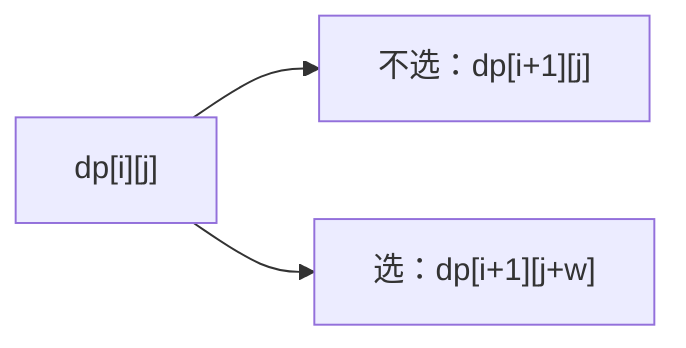
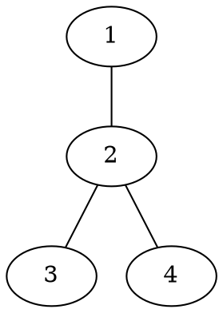

# 题解可视化辅助规范

题解可以使用 Mermaid、Graphviz、`tree_draw.py`、Markdown 表格和图片解释样例数据或算法过程。可视化的目标是帮助读者更快理解题目，不是装饰页面。

## 使用场景

推荐按题型选择：

| 题型 | 推荐形式 | 说明 |
| --- | --- | --- |
| 图论 | Graphviz dot / Mermaid | 画样例图、DAG、拓扑关系、最短路局部过程 |
| 树 | `tree_draw.py` / Mermaid | 画样例树、递归关系、父子关系 |
| 二叉树 / 线段树 | `tree_draw.py` | 画二叉树、线段树区间结构、静态数据结构图 |
| DP / 背包 | Markdown 表格 | 展示状态定义、样例状态表、关键转移 |
| 网格 | Markdown 表格 | 展示起点、终点、障碍、可走区域 |
| 搜索 / 递归 | Mermaid / Graphviz dot | 展示搜索树或状态扩展 |
| 模拟 | Markdown 表格 | 展示样例过程中变量或数组的变化 |

普通题解建议最多 1 到 2 个可视化块，难题最多 3 个。图超过 30 个节点、DP 表超过 `10 x 10`、搜索树超过 3 层时，只展示关键局部。

## 写作要求

每个可视化块都必须有解释文字：

1. 图前说明“这张图展示什么”。
2. 图后用 2 到 5 句话说明“读者应该看什么”。
3. 表格必须解释行、列、单元格含义。
4. 不添加没有教学目的的图。

## Mermaid

题解页面已经加载 Mermaid。直接在 `index.md` 中使用：

````markdown
#### 状态转移图

这张图展示状态 `dp[i][j]` 的两个后继：



从图中可以看到，每个物品都有“不选”和“选”两条路。
这就是 0/1 背包转移式的来源。
````

建议：

- Mermaid 节点 ID 使用 ASCII，例如 `S0`、`A1`。
- 中文写在 label 或正文说明里。
- 优先画样例或局部结构，不画过大的完整状态图。

## Graphviz

Markdown 渲染器会把 `dot` / `graphviz` 代码块识别成 Graphviz 内容。目前推荐两种用法：

1. 在题解里保留 dot 源码，方便维护。
2. 使用 `scripts/problem-tools/dot2png.py` 生成图片后插入题解。

dot 源码示例：

````markdown
#### 样例图

这张图把样例边画成无向图：



节点 `2` 是样例中的分叉点。
后面分析 DFS 时，可以重点观察从 `2` 出发的几条边。
````

生成图片：

```bash
python3 scripts/problem-tools/dot2png.py sample.dot sample.png
```

插入图片：

```markdown

```

如果需要把边列表转成 dot，可以使用：

```bash
python3 scripts/problem-tools/input2dot.py < sample.in > sample.dot
```

## tree_draw.py

`tree_draw.py` 适合绘制树类数据结构，默认输出 SVG。它使用固定坐标布局，不依赖 Graphviz 的自动布局。

普通树：

```bash
tree_draw.py --type normal --input tree.txt --output tree.svg --markdown
```

二叉树：

```bash
tree_draw.py --type binary --input binary.txt --output binary.svg --markdown
```

线段树结构：

```bash
tree_draw.py --type segment --size 8 --output segment.svg --markdown --alt "线段树结构图"
```

在题目目录中配合 `ptool`：

```bash
ptool --cd problems/luogu/Pxxxx tree_draw --type binary --input tree.txt --output tree.svg --markdown
```

题解中插入：

```markdown

```

详细说明见 [`docs/tools/tree_draw.md`](tools/tree_draw.md)。

## Markdown 表格

DP、背包、网格和模拟题优先使用 Markdown 表格。

```markdown
#### DP 表格

这张表展示样例中前两层状态的变化：

| i \ j | 0 | 1 | 2 |
| --- | --- | --- | --- |
| 0 | 1 | 0 | 0 |
| 1 | 1 | 1 | 0 |

行表示已经处理到第 `i` 个元素。
列表示当前容量或状态值 `j`。
单元格中的值是 `dp[i][j]`。
```

表格不要太大。大表只展示关键行列，正文说明省略了哪些部分。
