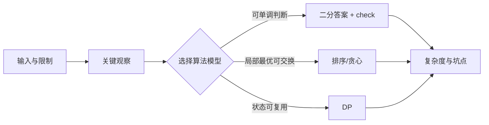
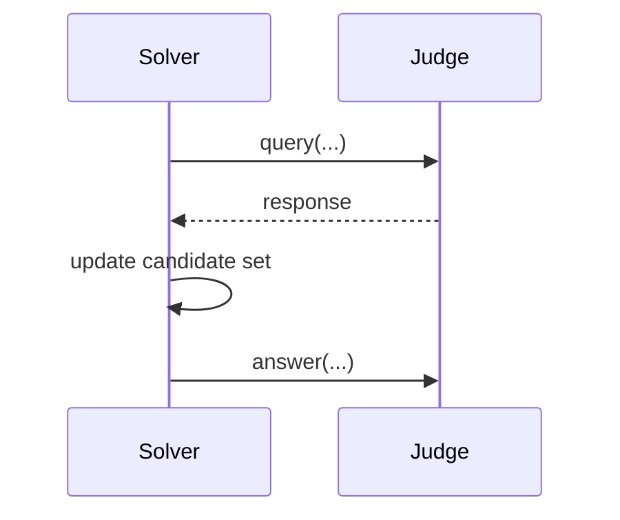

# Visual Patterns for OJ Algorithm Explanations

## 1. Flowchart explainer

Use for constructive, greedy, simulation, and interactive problems.

Recommended layout:

- Top: title and one-sentence core idea.
- Left panel: observations and preprocessing.
- Middle panel: main algorithm flow.
- Right panel: branches, special cases, or hard part.
- Bottom: pitfalls and complexity.

Mermaid skeleton:

## 2. DP table explainer

Use for linear DP, knapsack, interval DP, and sequence DP.

Must include:

- State definition: `dp[i][j]` means what.
- Transition: from which states to which state.
- Initialization.
- Enumeration order.
- Answer location.

For strict DP table diagrams, prefer SVG because generated images often corrupt table values.

Panel suggestion:

1. 状态定义
2. 转移来源
3. 表格填充顺序
4. 样例中的 2-3 个关键格子
5. 复杂度

## 3. Interval DP explainer

Use triangular table layout.

Show:

- `len = 1, 2, 3...` enumeration.
- Interval `[l,r]` as table cell.
- Split point `k` arrows: `[l,k] + [k+1,r]`.

## 4. Tree DP and rerooting explainer

Use a rooted tree. Mark:

- Root.
- Subtree boundary.
- Child contribution arrows upward.
- For rerooting, show two phases: downward first pass and upward second pass.

Checklist:

- Is the root arbitrary or fixed by the problem?
- Are states per node, per edge, or per subtree?
- Is merge order important?

## 5. MST explainer

Use for Kruskal, Prim, virtual-node MST, clustering, and repair/build-network problems.

Show:

- Original graph with all weighted edges.
- Sorted edge list.
- Chosen edges in green, rejected cycle edges in red/gray.
- DSU components after key steps.
- If virtual nodes are used, draw the virtual node with dashed edges and explain what each virtual edge represents.

## 6. Shortest-path explainer

Use for Dijkstra, BFS, 0-1 BFS, Floyd, layered graph, and state graph.

Show:

- What a graph node represents.
- What an edge represents.
- Whether edge weight is cost, time, operation count, or transformed value.
- Relaxation step: `dist[v] > dist[u] + w`.
- For layered graphs: layer meaning and cross-layer transition.

## 7. Binary-search-answer explainer

Show:

- Answer interval `[L,R]`.
- Predicate `check(x)`.
- Monotonic direction.
- How `mid` changes the interval.
- Common mistake: binary searching a non-monotonic value.

## 8. Data structure explainer

Segment tree:

- Show intervals on nodes.
- Show lazy tag propagation.
- Distinguish build, pushdown, update, query.

Fenwick tree:

- Show `lowbit(x)` ranges.
- Show prefix query path: `x -= lowbit(x)`.
- Show update path: `x += lowbit(x)`.

Monotonic queue:

- Show window boundary.
- Show removed elements: out-of-window vs worse candidate.

## 9. String algorithm explainer

KMP/Z:

- Show pattern and text alignment.
- Show `next`/`z` array meaning.
- Show fallback arrows.

Trie:

- Show root-to-word paths.
- Mark terminal nodes and count values.

Rolling hash:

- Show substring slice `[l,r]`.
- Show normalized hash comparison.
- Warn about collision and recommend double hash when appropriate.

## 10. Interactive-problem explainer

Use for Codeforces interactive or query-response inference problems.

Show:

- Initialization.
- Query format.
- What information the response reveals.
- Candidate set update.
- Termination condition.
- Protocol pitfalls: output format, `flush`, query limit.

Use Mermaid sequence diagram when exact query order matters:

