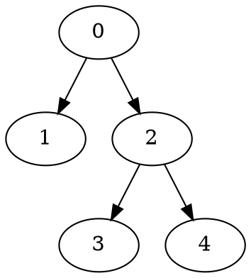
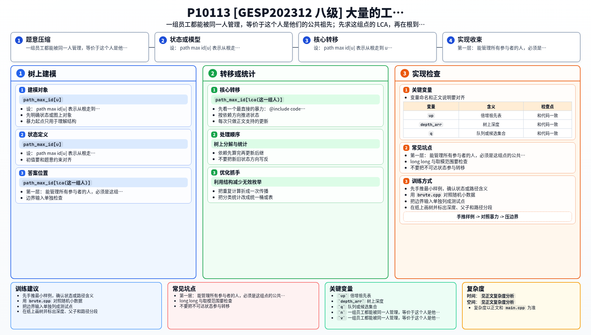

[[TOC]]

### 题意

公司组织结构是一棵以 `0` 为根的树：

- `0` 号员工是老板
- 其余每个员工都有一个直接领导

员工 `x` 能管理员工 `y`，当且仅当：

- `x = y`
- 或者 `x` 是 `y` 的祖先

每次给出一组要合作的员工，要求找一个主持人，使得他能管理这组里的所有人。

如果满足条件的人有很多个，要输出：

- 编号最大的那个

#### 样例树

样例一的树结构是：

对于员工集合 `{3,4}`：

- 公共祖先有 `2` 和 `0`
- 其中编号更大的是 `2`

所以答案是 `2`。

### 思路

先看一个最直接的暴力：

@include-code(./brute.cpp, cpp)

暴力做法是：

1. 枚举谁来当主持人
2. 逐个判断他是不是所有参与者的祖先
3. 在所有合法人里取编号最大

这个办法很直观，但一次查询最坏要把整棵树都扫一遍。

关键观察有两层。

第一层：

- 能管理所有参与者的人，必须是这组点的公共祖先

第二层：

- 所有公共祖先，恰好就是“这组点的 LCA 到根这条链上的所有点”

因为：

- 最低的那个公共祖先就是这组点的 LCA
- 比它更高的祖先也都能管理所有人
- 而 LCA 以下的人不可能同时管理不同分支上的参与者

所以题目并不是“输出 LCA”，而是：

1. 先求出这一组员工的 LCA
2. 再在“根到 LCA”的路径上找编号最大的点

第二步也很容易预处理。
设：

- `path_max_id[u]` 表示从根走到 `u` 这条路径上的最大编号

那么每次查询的答案就是：

- `path_max_id[lca(这一组人)]`

于是整题就变成了标准的倍增 LCA 预处理，再把一组点不断两两合并成一个总 LCA。

### 代码

@include-code(./main.cpp, cpp)

### 复杂度

设树有 `n` 个点，一次查询有 `m` 个参与者。

- 预处理倍增祖先表：`O(n log n)`
- 单次两点 LCA：`O(log n)`
- 一次查询把 `m` 个点不断合并：`O(m log n)`

空间复杂度：

- `O(n log n)`

### 总结

这题最容易走偏的地方是：

- 不是“编号最大的公共祖先 = LCA”

LCA 只是“最深的公共祖先”，而题目要的是“编号最大的公共祖先”。

真正正确的转化是：

1. 先用 LCA 把“公共祖先集合”压成一条链
2. 再用 `path_max_id` 在这条链上取最大编号

所以这是一道：

- `倍增 LCA`
- 加一个很自然的路径前缀最大值

的组合题。

### 一图流解析

这张图把本题的建模、关键转移、实现检查和训练方法压缩到一页，适合读完正文后复盘。

