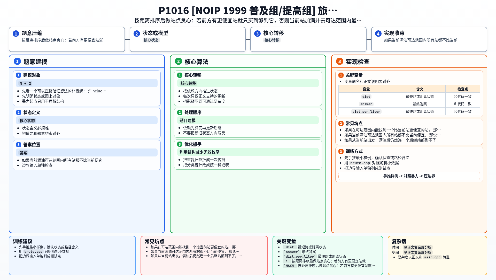

[[TOC]]

### 题意

从起点开车到终点，初始油箱为空。

已知：

- 总路程 `S`
- 油箱容量 `C`
- 每升油可行驶距离 `L`
- 起点油价 `P0`
- 沿途若干加油站的位置和油价

要求用最小花费到达终点；如果到不了，输出 `No Solution`。

### 思路

先看一个可以直接验证想法的朴素解：

@include-code(./brute.cpp, cpp)

这题的关键不在搜索，而在一个很典型的加油贪心。

把起点也看作一个站，再把终点看作价格为 `0` 的虚拟站。
站点按距离排序后，站在当前站时，只关心“满油能到达的范围”。

接下来分两种情况。

#### 1. 前方存在更便宜的站

如果在可达范围内能找到一个比当前站更便宜的站，
那么当前站只需要买“刚好够到那个更便宜站”的油。

因为多买出来的那部分油，本来可以留到更便宜的站再买，
提前在当前更贵的地方买只会让总费用更高。

#### 2. 前方不存在更便宜的站

如果当前满油可达范围内所有站都不比当前便宜，
那说明在这一整段路里，当前站就是最划算的买油点。

所以这时最优策略是：

- 直接把油箱加满；
- 然后开到可达范围内油价最低的那个站。

#### 无解情况

如果从当前站出发，满油后仍然连一个后继站都到不了，
那就说明根本无法到达终点，直接输出 `No Solution`。

### 代码

@include-code(./main.cpp, cpp)

### 复杂度

设总站点数为 `N + 2`（包含起点和终点虚拟站）。

每一步向右扫描当前可达范围，所以时间复杂度是 `O(N^2)`，
空间复杂度是 `O(N)`。

### 总结

这道题最重要的是把“买多少油”转化成价格比较问题：

- 有更便宜站，就只买够到它；
- 没有更便宜站，就当前加满。

一旦这个贪心规则想清楚，代码实现就很直接了。

### 一图流解析

这张图把本题的建模、关键转移、实现检查和训练方法压缩到一页，适合读完正文后复盘。

