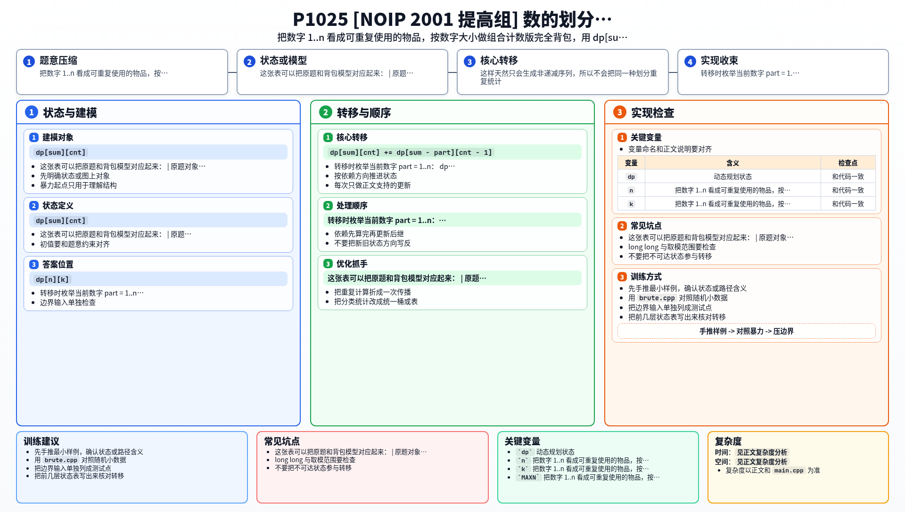

[[TOC]]

### 题意

给定两个整数 `n` 和 `k`，要求把 `n` 分成 `k` 个正整数之和。

这里“不考虑顺序”，也就是说：

- `1 + 1 + 5`
- `1 + 5 + 1`
- `5 + 1 + 1`

都算同一种方案。

要求输出不同划分方案的数量。

### 思路

先看一个最直接、最符合题意的暴力：

@include-code(./brute.cpp, cpp)

这个暴力用 DFS 一份一份地选数字，并且强制后面选的数不能比前面更小。
这样天然只会生成非递减序列，所以不会把同一种划分重复统计。

正式做法可以把它进一步改写成 DP。

#### 为什么能转成完全背包

把这题换个视角，不去想“第几份填什么数”，而是去想：

- 数字 `1` 用几个
- 数字 `2` 用几个
- 数字 `3` 用几个
- ...

这样一来，每个数字 `1..n` 都像一种可以重复使用的物品。

这张表可以把原题和背包模型对应起来：

| 原题对象 | 背包含义 |
| --- | --- |
| 数字 `part` | 一种可以重复使用的物品 |
| 选一个 `part` | 总和增加 `part` |
| 一共选了几个数 | 已经分成了多少份 |
| 目标 | 恰好凑出总和 `n` 且份数为 `k` |

所以设：

- `dp[sum][cnt]` 表示凑出和为 `sum`，并且恰好用了 `cnt` 个数的方案数

初始化：

- `dp[0][0] = 1`

表示什么都不选，凑出 `0`，用了 `0` 份，有 `1` 种方法。

转移时枚举当前数字 `part = 1..n`：

`dp[sum][cnt] += dp[sum - part][cnt - 1]`

这里外层按 `part` 从小到大处理，作用和组合计数版完全背包完全一样：

- 当前数字可以重复使用
- 不同顺序不会被当成不同方案

最后答案就是 `dp[n][k]`。

### 代码

@include-code(./main.cpp, cpp)

### 复杂度

- 时间复杂度：`O(n^2 * k)`
- 空间复杂度：`O(n * k)`

### 总结

这题本质上是“固定份数的整数划分”。

最关键的识别点有两个：

1. 不考虑顺序，所以要按固定顺序生成方案，避免重复
2. 每个数字都可以重复使用，所以可以转成完全背包计数

以后看到“把一个数拆成若干份、统计方案数、顺序不重要”这类题时，可以优先往整数划分和完全背包计数上想。

### 一图流解析

这张图把本题的建模、关键转移、实现检查和训练方法压缩到一页，适合读完正文后复盘。

