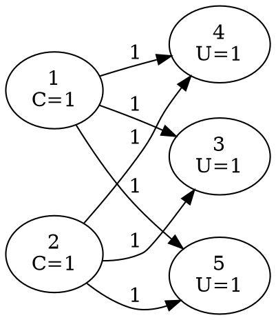

[[TOC]]

### 题意

题目给了一张分层有向图，每个点是一个神经元。

- 输入层神经元的当前状态 `C[i]` 已经给出
- 非输入层神经元有阈值 `U[i]`
- 边 `j -> i` 有权值 `W[j][i]`

当一个神经元最终状态 `C[i] > 0` 时，它才会向后继传递强度为 `C[i]` 的信号。

要求求出所有输出层神经元（也就是出度为 `0` 的点）最后的状态；只输出状态大于 `0` 的输出层。如果一个都没有，就输出 `NULL`。

#### 样例图

这张图把样例中的网络结构画出来：

点 `3,4,5` 都会收到来自 `1` 和 `2` 的贡献 `1 + 1 = 2`，再减去自己的阈值 `1`，所以最后状态都变成 `1`。

### 思路

先看一个按定义递归求值的小数据版本：

@include-code(./brute.cpp, cpp)

这个版本直接按题意去算某个点的最终状态：

- 如果它是输入层，状态就是给定的 `C[i]`
- 如果它不是输入层，先从 `-U[i]` 开始
- 然后枚举所有前驱 `j`
- 只有当 `j` 的最终状态大于 `0` 时，才加上 `W[j][i] * C[j]`

正式做法不必真的递归，因为题目已经保证图是分层的，也就是一张 DAG。

于是可以按拓扑序模拟整个传播过程：

1. 统计每个点的入度和出度。
2. 对所有非输入层，先把 `C[i]` 改成 `C[i] - U[i]`。在本题数据里，非输入层初始 `C[i]` 通常是 `0`，所以这一步等价于先设成 `-U[i]`。
3. 把所有入度为 `0` 的点入队。
4. 依次弹出点 `u`：
   - 如果 `C[u] > 0`，说明它处于兴奋状态，就把 `C[u] * W[u][v]` 加到每个后继 `v` 上
   - 无论它是否兴奋，这条边都算处理过，所以都要给后继入度减一
5. 最后扫描所有出度为 `0` 的点，输出状态大于 `0` 的那些。

这里最容易错的地方只有一个：**平静状态的神经元不会继续传信号。**

### 代码

@include-code(./main.cpp, cpp)

### 复杂度

设点数为 `n`，边数为 `m`。

- 每个点入队出队一次
- 每条边只被扫描一次

时间复杂度 `O(n + m)`，空间复杂度 `O(n + m)`。

### 总结

这题本质不是复杂 DP，而是 DAG 上的顺序模拟。识别出“分层有向图 + 只从上一层到下一层传递”以后，直接按拓扑序把状态往后推就行。
