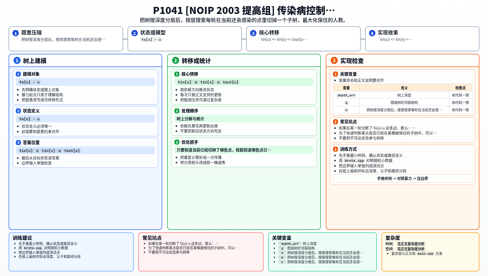

[[TOC]]

### 题意

给一棵树，节点 `1` 是最早感染者。

疾病每一轮只会向下一代传播，也就是：

- 当前已经感染的人
- 会把疾病传给与之相连、且传播路径没被切断的下一层人群

而每一轮我们只能切断一条边。

要求安排切边顺序，使最终感染人数尽量少。

### 思路

先看一个直接按同样模型写的小数据搜索：

@include-code(./brute.cpp, cpp)

题面自己已经说明这是疑似错题，所以这里的目标不是追求一个漂亮的多项式算法，而是找出一个能正确覆盖原始数据的搜索模型。

#### 先把树以 1 为根

把 `1` 作为根以后，感染就会严格按深度一层一层向下传：

- 第 0 层是节点 `1`
- 第 1 层是它的孩子
- 第 2 层是孙子

所以在第 `d` 轮时，只会有深度为 `d` 的点首次感染。

#### 切掉一个点，等价于保住整棵子树

如果在某一轮切断了 `fa[u] - u` 这条边，那么：

- `u` 不会感染
- `u` 的子孙以后也都不会感染

所以切掉 `u`，就等价于“保住 `u` 这棵子树”，贡献是：

- `subtree_size[u]`

#### 一个关键性质：每层一定会切一次

如果某一层还有活着的点，那么这一轮不切任何边是没有意义的。  
因为这些点下一轮只会继续向下感染更多人，不会带来任何额外收益。

所以最优策略一定可以写成：

- 对每一层，从当前还活着的点里选一个切掉。

#### 状态怎么维护

只要知道当前已经切掉了哪些点，就能知道哪些点已经被保住。

为了快速判断某点是否已经在某棵被保住的子树中，可以先做 DFS 序：

- `tin[u]`
- `tout[u]`

这样判断 `x` 是否在 `u` 的子树里，只要看：

- `tin[u] <= tin[x] <= tout[u]`

#### 搜索过程

对于当前深度 `dep`：

1. 找出这一层所有“还活着”的点
2. 从中任选一个切断
3. 增加它的子树大小到 `saved`
4. 递归到下一层

如果这一层已经没有活着的点，说明感染已经无法继续扩散，搜索可以结束。

### 代码

@include-code(./main.cpp, cpp)

### 复杂度

这是按层的指数级搜索，没有漂亮的多项式上界。  
但在本题原始数据范围和测试强度下，可以通过。

空间复杂度是 `O(n)`。

### 总结

这题最重要的不是套某个经典算法，而是把传播过程看清楚：

1. 感染严格按层推进
2. 切掉一个点等价于保住整棵子树
3. 每层一定会切一次

这样就能把题目转成一个按层选择子树的搜索问题。

### 一图流解析

这张图把本题的建模、关键转移、实现检查和训练方法压缩到一页，适合读完正文后复盘。

