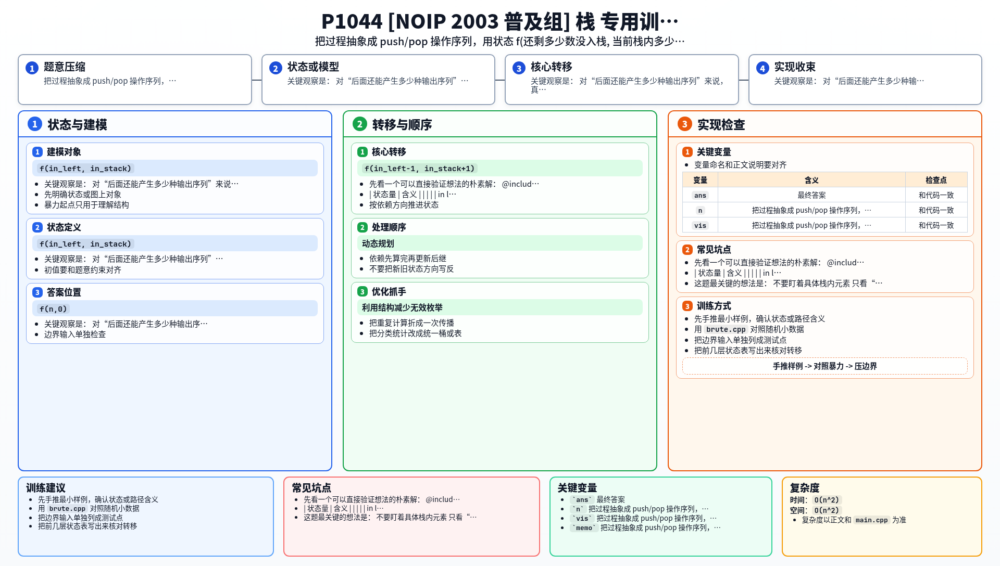

[[TOC]]

### 题意

给定固定入栈顺序 `1,2,...,n`。

你可以不断执行两种操作：

- 把下一个数压入栈
- 把栈顶弹出并加入输出序列

问最终一共能得到多少种不同的输出序列。

### 思路

先看一个可以直接验证想法的朴素解：

@include-code(./brute.cpp, cpp)

这个暴力直接枚举整个操作过程：

- 如果还有数没入栈，就可以 `push`
- 如果栈非空，就可以 `pop`

直到所有元素都弹出为止。

关键观察是：  
对“后面还能产生多少种输出序列”来说，真正重要的不是栈里具体装了哪些数，而是：

- 还有多少个数没入栈
- 当前栈里有多少个数

于是定义状态：

`f(in_left, in_stack)`

表示：

- 还有 `in_left` 个数等待入栈
- 当前栈里有 `in_stack` 个数

时，后续一共有多少种合法出栈序列。

#### 状态表的含义

| 状态量 | 含义 |
| --- | --- |
| `in_left` | 还没入栈的元素个数 |
| `in_stack` | 当前栈内元素个数 |
| `f(in_left, in_stack)` | 从该状态出发的合法后续方案数 |

转移很自然：

- 入栈：`f(in_left-1, in_stack+1)`
- 出栈：若 `in_stack > 0`，加上 `f(in_left, in_stack-1)`

边界：

- 当 `in_left == 0` 时，后面只能把栈里剩下的元素全部弹完，所以方案数是 `1`

答案就是：

- `f(n,0)`

这其实就是经典的 Catalan 数模型，只不过这里用“栈状态”来写，会更贴近题面。

### 代码

@include-code(./main.cpp, cpp)

### 复杂度

- 状态数 `O(n^2)`
- 每个状态最多两次转移
- 总时间复杂度 `O(n^2)`
- 空间复杂度 `O(n^2)`

### 总结

这题最关键的想法是：

- 不要盯着具体栈内元素
- 只看“还剩多少个没进栈”和“现在栈里有多少个”

一旦这样建模，问题就从搜索树变成了一个很规整的记忆化 DP，也自然对应到了 Catalan 数。

### 一图流解析

这张图把本题的建模、关键转移、实现检查和训练方法压缩到一页，适合读完正文后复盘。

