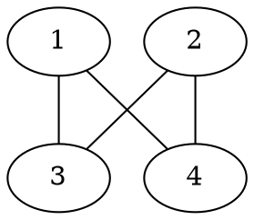

[[TOC]]

### 题意

有 `n` 个同学一开始按 `1,2,...,n` 围成一个圈。

第 `i` 个同学给出两个自己最希望相邻的人。
一次操作可以选出若干个同学，让他们整体做一次循环换位，代价等于这次被移动的人数。

问能否调整到一个满足所有人愿望的围圈方案；如果能，最小总代价是多少。

### 思路

先看一个可以直接验证想法的朴素解：

@include-code(./brute.cpp, cpp)

`brute.cpp` 直接枚举所有最终座次，检查这一圈是否满足每个人的愿望，然后取最小答案。

这个思路只适合很小的数据，因为它需要枚举全排列。

先把每个人和他希望相邻的两个人连成无向边。
样例会得到下面这张愿望图：



这张图展示的就是“最终谁必须和谁相邻”。
如果图里有一条边不是双方互相承认的，或者整张图不是一个包含全部同学的单环，那就一定无解。
因为真正围成一个圈时，每个人最终都只能有两个邻居，而且所有人必须在同一个大圈里。

所以先做两个判定：

1. 愿望关系必须对称；
2. 整张愿望图必须是一整个 `n` 个点的单环。

一旦这个环存在，最终合法座次其实只剩两种写法：

- 沿着环正着写；
- 沿着环反着写。

同一个方向下，不同方案只差一个整体旋转。

接下来考虑代价。

如果最终某个同学不在原来的位置上，那么他至少要被移动一次，所以总代价不会小于“离开原位的人数”。

反过来，把初始座次到目标座次看成一个置换。
这个置换可以拆成若干个不相交的置换环。
长度为 `k` 的置换环，可以直接用一次长度为 `k` 的循环换位命令完成，代价正好是 `k`。

所以最小总代价，恰好等于最终离开原位的人数。

于是问题变成：

- 在正向环序和反向环序的所有整体旋转中，哪一个能让留在原位置的人数最多？

设某个方向下写出的环序是 `order[0..n-1]`。

对学生 `x` 来说，他原来的位置是 `x-1`。
如果 `x` 现在位于 `order[pos]`，那么只有一个固定的旋转量，能把他转回到原位。

所以只要对每个学生都算出这个旋转量，并给这个旋转量记一票：

- 一种旋转量得到多少票
- 就表示这种整体旋转能保留多少个人不动

对正向和反向都各统计一次，取最大保留人数 `best_keep`，答案就是：

```text
n - best_keep
```

### 代码

@include-code(./main.cpp, cpp)

### 复杂度

时间复杂度是 `O(n)`，空间复杂度是 `O(n)`。

### 总结

这题表面上是在优化一串换位操作，真正的关键有两个：

1. 满足愿望的最终座次，实际上被“愿望图是一整个单环”完全限定住了；
2. 操作代价可以化成“最后有多少人离开原位”。

把这两个结论接起来，原题就变成了一个很干净的图论判定 + 环形统计问题。
