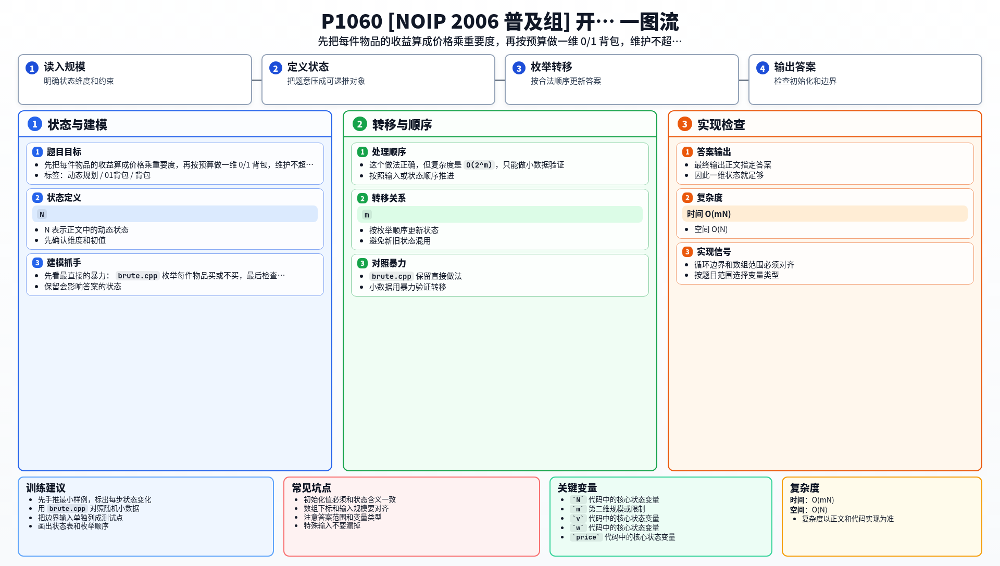

[[TOC]]

### 题意

给出总预算 `N` 和 `m` 件物品。

每件物品有：

- 价格 `v`
- 重要度 `w`

如果买下它，就会贡献一份满意度：

- `v * w`

要求在总花费不超过 `N` 的前提下，让满意度总和最大。每件物品最多买一次。

### 思路

先看最直接的暴力：

@include-code(./brute.cpp, cpp)

`brute.cpp` 枚举每件物品买或不买，最后检查总花费是否超限。

这个做法正确，但复杂度是 `O(2^m)`，只能做小数据验证。

关键观察是：这题本质上仍然是 0/1 背包，只是物品的“价值”不是直接给出的，而是需要先算：

- `value = price * importance`

于是题目就变成：

- 预算 `N` 是背包容量
- 每件物品最多选一次
- 物品重量是 `price`
- 物品价值是 `price * importance`

设：

- `dp[j]` 表示花费不超过 `j` 时，能够得到的最大满意度

加入一件物品时：

- 不买它：状态不变
- 买它：从 `dp[j - price]` 转移，再加上它的价值

所以转移是：

- `dp[j] = max(dp[j], dp[j - price] + price * importance)`

由于每件物品只能买一次，预算维必须倒序枚举。

#### 状态表

这张表说明状态的含义：

| 状态 | 含义 |
| --- | --- |
| `dp[j]` | 花费不超过 `j` 时，能够得到的最大满意度 |

从这个定义可以看出，DP 只关心“花了多少钱”以及“能得到多少满意度”，不需要记录具体买了哪些物品。
因此一维状态就足够。

最后输出 `dp[N]` 即可。

#### DP 公式

设 $dp_j$ 表示花费不超过 $j$ 时能得到的最大满意度。第 $i$ 件物品价格为 $v_i$，重要度为 $p_i$，价值为 $v_i p_i$，转移为：

$$
dp_j=\max(dp_j,\ dp_{j-v_i}+v_i p_i)
$$

其中 $j\ge v_i$，且预算倒序枚举。最终答案为：

$$
dp_N
$$

公式解释：物品价格是容量消耗，价格乘重要度才是真正收益。每件物品只买或不买一次，所以从 `j-v_i` 转移并倒序枚举预算。

### 代码

@include-code(./main.cpp, cpp)

### 复杂度

- 时间复杂度：`O(mN)`
- 空间复杂度：`O(N)`

### 总结

这题和普通 0/1 背包的区别只有一点：

- 价值不是直接输入，而是 `价格 * 重要度`

只要先把这一层题意翻译出来，后面的状态设计和转移就和标准模板完全一致了。

### 一图流解析

这张图把本题的建模、关键转移、实现检查和训练方法压缩到一页，适合读完正文后复盘。

