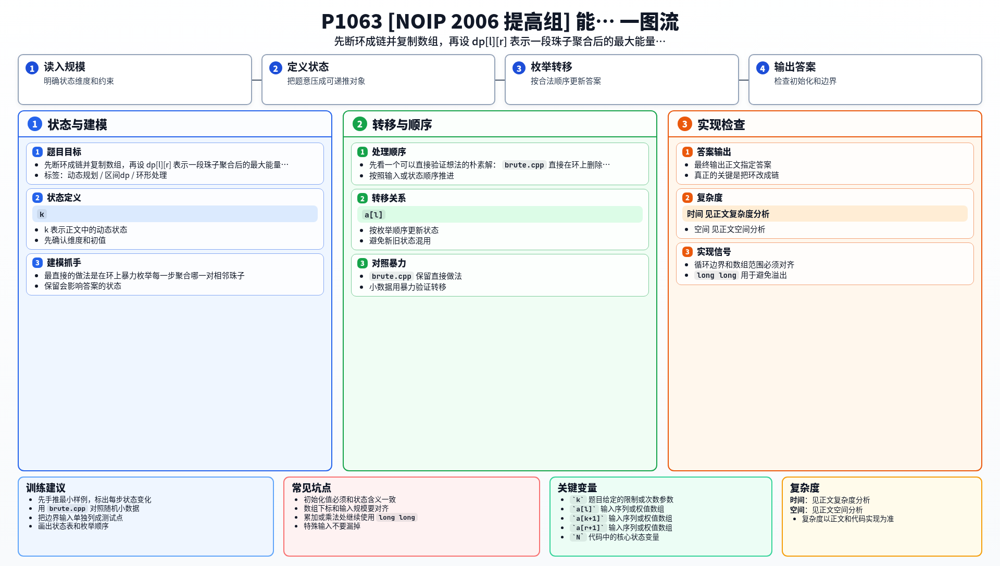

[[TOC]]

### 题意

给出一串环形能量项链。每颗珠子可以看成一对标签 `(a_i, a_{i+1})`，相邻两颗珠子聚合时会释放 `m * r * n` 的能量，并生成一颗新的珠子。

要求安排聚合顺序，使最后总能量最大。

### 思路

最直接的做法是在环上暴力枚举每一步聚合哪一对相邻珠子。

先看一个可以直接验证想法的朴素解：

@include-code(./brute.cpp, cpp)

`brute.cpp` 直接在环上删除中间标签，完整枚举所有聚合顺序，适合小数据对拍。

真正的关键是把环改成链。对链上的一段珠子 `[l, r]`，如果最后一次合并断在 `k`，那么最后一步产生的能量只和三个标签有关：

- 左端标签 `a[l]`
- 中间连接标签 `a[k+1]`
- 右端外侧标签 `a[r+1]`

于是可以设：

`dp[l][r] = max(dp[l][k] + dp[k+1][r] + a[l] * a[k+1] * a[r+1])`

为了处理原题的环形结构，把输入数组复制一遍。这样每个长度为 `N` 的区间都对应原环的一种断开方式，最后取最大值即可。

这张表说明 `dp[l][r]` 与几个关键标签的关系：

| 状态 | 左端标签 | 右端外侧标签 | 表示什么 |
| --- | --- | --- | --- |
| `dp[2][2]` | `a[2]` | `a[3]` | 单颗珠子，不能再聚合 |
| `dp[2][4]` | `a[2]` | `a[5]` | 链上第 2 到第 4 颗珠子聚合后的最大能量 |
| `dp[i][i+n-1]` | `a[i]` | `a[i+n]` | 原环从第 `i` 处断开后的答案 |

读这张表时，重点是理解 `a[r+1]` 不是越界的多余量，而是当前链右侧那颗珠子的尾标签。正因为珠子的结构决定了最后一步只看这三个标签，区间 DP 才能成立。

#### DP 公式

把环复制成长度 $2n$ 的链。设 $dp_{l,r}$ 表示链上第 $l$ 到第 $r$ 颗珠子聚合后的最大能量，枚举最后一次聚合的断点 $k$：

$$
dp_{l,r}=\max_{l\le k<r}\left(dp_{l,k}+dp_{k+1,r}+a_l\cdot a_{k+1}\cdot a_{r+1}\right)
$$

每个长度为 $n$ 的区间对应一种断环方式，答案为：

$$
\max_{1\le i\le n} dp_{i,i+n-1}
$$

公式解释：最后一次聚合会选一个断点，把链分成左右两段。左右两段的最优能量已经由较短区间算出，最后合并额外产生的能量由三个边界标签决定。

### 代码

@include-code(./main.cpp, cpp)

### 复杂度

区间 DP 需要枚举区间长度、左端点和断点，所以时间复杂度是 `O(N^3)`，空间复杂度是 `O(N^2)`。

### 总结

这题的核心是先把环形结构变成可以处理的链，再用“最后一次合并”建立区间 DP。断环成链是入口，区间转移是本体。

### 一图流解析

这张图把本题的建模、关键转移、实现检查和训练方法压缩到一页，适合读完正文后复盘。

