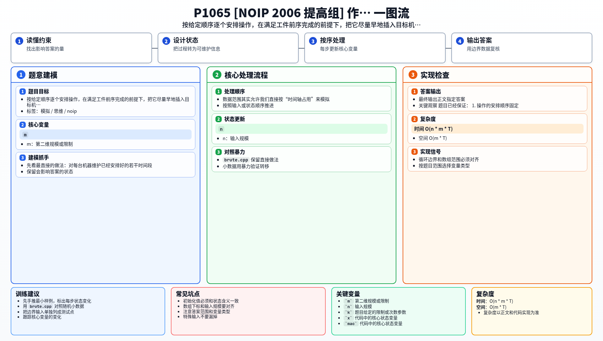

[[TOC]]

### 题意

有 `m` 台机器、`n` 个工件。

每个工件都有 `m` 道工序，第 `k` 道工序要在指定机器上加工指定时间，而且同一个工件必须按工序顺序完成。

题目还给了一个“安排顺序”。当轮到某个操作被安排时：

- 它必须等本工件前一道工序完成；
- 它所在机器同一时刻不能加工别的工件；
- 并且要在满足条件的前提下，尽量插入最靠前、最早出现的空档。

要求输出按照这个唯一规则安排完全部操作后的总完成时间。

### 思路

先看最直接的做法：对每台机器维护已经安排好的若干时间段。

当一个新操作要插入时，从它的最早可开始时间往后枚举，检查当前这个起点是否和机器上的已有区间冲突：

@include-code(./brute.cpp, cpp)

这个思路是对的，但如果每次都拿候选起点和所有已安排区间逐一比较，实现比较绕，而且常数也更大。

这题的数据范围其实允许我们直接按“时间轴占用”来模拟。

#### 关键观察

题目已经保证：

1. 操作的安排顺序固定；
2. 每次插入都必须“尽量靠前”；
3. 若有多个空档可放，要选最前面的那个。

因此我们只需要老老实实按顺序处理每个操作，并在对应机器上找“最早能放下这段连续时间”的位置。

#### 如何找到最早空档

设当前要安排的是工件 `x` 的下一道工序：

- 它要去机器 `mac`；
- 加工时长是 `cost`；
- 它的前一道工序完成时间是 `ready`。

那么它的开始时间绝不可能早于 `ready`。

于是从 `start = ready` 开始往后找：

- 如果区间 `[start, start + cost - 1]` 上机器都空闲，就把它放在这里；
- 如果中间某个时刻已经被占用，就说明这个起点不行，把 `start` 推到冲突位置后面继续找。

找到以后：

- 把这段时间在线程上标成已占用；
- 更新这个工件最新完成时间；
- 维护全局最大完成时间。

### 代码

@include-code(./main.cpp, cpp)

### 复杂度

- 时间复杂度：`O(n * m * T)`
- 空间复杂度：`O(m * T)`

这里 `T` 是最终时间轴长度。由于本题原始数据范围很小，这个直接模拟是足够的。

### 总结

这题的关键不是复杂调度算法，而是严格按题目规定的“唯一插入规则”去模拟。

一旦认识到方案唯一，剩下就是把每个操作按顺序塞进目标机器的最早可行空档。

### 一图流解析

这张图把本题的建模、关键转移、实现检查和训练方法压缩到一页，适合读完正文后复盘。

