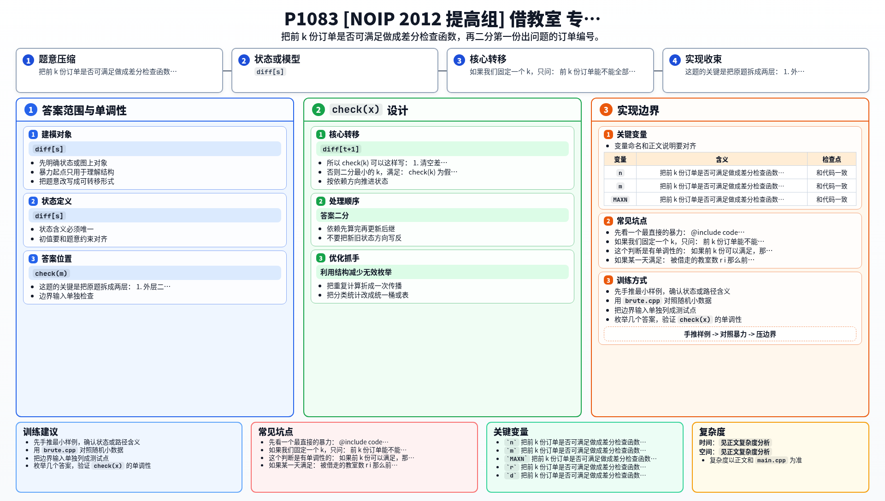

[[TOC]]

### 题意

未来有 `n` 天教室资源，第 `i` 天有 `r_i` 个教室可借。

有 `m` 份订单，按顺序处理。  
每份订单 `(d, s, t)` 表示从第 `s` 天到第 `t` 天，每天都要借 `d` 个教室。

规则是先到先得：

- 如果某份订单可以满足，就把对应天数的教室扣掉
- 如果某份订单无法满足，就立刻停止，并输出这份订单编号

要求判断：

- 所有订单是否都能满足
- 如果不能，第一份出问题的是哪一份

### 思路

先看一个最直接的暴力：

@include-code(./brute.cpp, cpp)

`brute.cpp` 按题目流程逐份订单模拟：

1. 先检查这份订单覆盖的每一天是否都还有足够教室
2. 如果可以，就逐天扣减
3. 如果不行，就输出当前订单编号

这个思路最贴近题意，但时间复杂度太高。

#### 第一步：把问题改写成“前 k 份订单是否可行”

如果我们固定一个 `k`，只问：

- 前 `k` 份订单能不能全部满足？

这个判断是有单调性的：

- 如果前 `k` 份可以满足，那么前 `1..k-1` 份一定也可以满足
- 如果前 `k` 份不能满足，那么再往后加订单也不可能重新变可行

于是答案就是：

- 第一份使系统失效的订单编号

这就天然可以二分。

#### 第二步：如何快速检查前 k 份订单

对于前 `k` 份订单，每份订单 `(d, s, t)` 都是在区间 `[s, t]` 上每天消耗 `d` 个教室。

这正是一个典型的区间加模型：

- 在 `diff[s]` 加上 `d`
- 在 `diff[t+1]` 减去 `d`

最后做一次前缀和，就能得到每一天总共被借走多少教室。

如果某一天满足：

`被借走的教室数 > r_i`

那么前 `k` 份订单就不可行。

所以 `check(k)` 可以这样写：

1. 清空差分数组
2. 把前 `k` 份订单全部打进差分
3. 扫一遍前缀和，检查是否有某天超出容量

#### 第三步：二分第一份失败订单

若 `check(m)` 成立，说明所有订单都能满足，输出 `0`。

否则二分最小的 `k`，满足：

- `check(k)` 为假

这个 `k` 就是第一份出问题的订单编号。

### 代码

@include-code(./main.cpp, cpp)

### 复杂度

- 每次 `check(k)` 的复杂度是 `O(n + k)`
- 二分一共调用 `O(log m)` 次
- 总复杂度可记为 `O((n + m) \log m)`

### 总结

这题的关键是把原题拆成两层：

1. 外层二分“第一份失败订单”
2. 内层差分检查“前 k 份订单是否可行”

一旦看出“前 k 份是否可行”具有单调性，题目就自然转成了“二分答案 + 差分判定”。

### 一图流解析

这张图把本题的建模、关键转移、实现检查和训练方法压缩到一页，适合读完正文后复盘。

