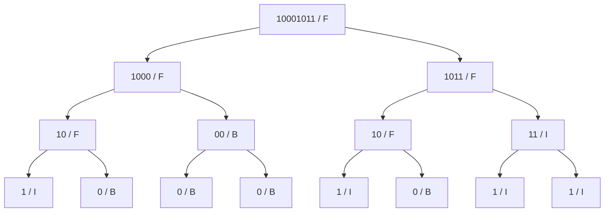
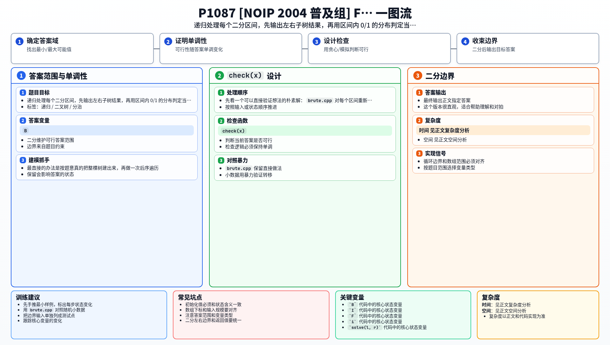

[[TOC]]

### 题意

给出一个长度为 `2^N` 的 01 串。每次把当前串的类型判成：

- 全 `0` 是 `B`
- 全 `1` 是 `I`
- 同时含 `0` 和 `1` 是 `F`

然后把它从中间分成左右两半，递归构造左右子树。题目要求输出这棵 FBI 树的后序遍历。

### 思路

最直接的办法是按题意真的把整棵树建出来，再做一次后序遍历。

先看一个可以直接验证想法的朴素解：

@include-code(./brute.cpp, cpp)

`brute.cpp` 对每个区间重新扫描一遍，判断它是 `B`、`I` 还是 `F`，然后显式建树。这个版本很直观，适合帮助理解和对拍。

正式解可以再进一步：我们其实不需要真的建树，只需要知道每个区间的类型，并按“左、右、根”的顺序输出。

#### 样例树

这张图展示样例串 `10001011` 递归切分后得到的 FBI 树：

从图里可以看到，每个结点都只对应原串中的一个连续区间，而且左右儿子就是这段区间的左右两半。
所以整棵树的结构早就由“不断二分”确定了，真正需要判断的只剩下每个区间的类型。
后序遍历也很直接：先输出左子树，再输出右子树，最后输出当前区间类型。

为了快速判断区间类型，可以先做一个前缀和数组，统计前 `i` 个字符里有多少个 `1`。这样就能在 `O(1)` 时间得到任意区间里 `1` 的数量：

- 数量为 `0`，当前结点是 `B`
- 数量等于区间长度，当前结点是 `I`
- 否则当前结点是 `F`

于是写一个 `solve(l, r)`：

1. 若区间长度为 `1`，直接输出类型
2. 递归处理左半段
3. 递归处理右半段
4. 最后输出整个区间的类型

这样就正好按后序遍历输出答案。

### 代码

@include-code(./main.cpp, cpp)

### 复杂度

设原串长度为 `m = 2^N`。

前缀和预处理是 `O(m)`，递归过程中每个结点只处理一次，所以总时间复杂度是 `O(m)`，空间复杂度是 `O(m)`。

### 总结

这题的关键不是“怎么建树”，而是看出树的结构已经由不断二分固定好了。剩下只要按后序递归顺序处理每个区间，并判断它属于 `B`、`I` 还是 `F` 就行。

### 一图流解析

这张图把本题的建模、关键转移、实现检查和训练方法压缩到一页，适合读完正文后复盘。

