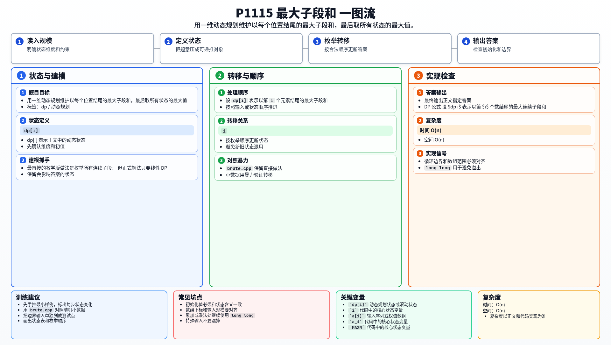

[[TOC]]

### 题意

给出一个整数序列，要求在所有连续且非空的子段中，找出和最大的那一段，并输出这个最大和。

### 思路

最直接的教学版做法是枚举所有连续子段：

@include-code(./brute.cpp, cpp)

但正式解法只要线性 DP。

设 `dp[i]` 表示以第 `i` 个元素结尾的最大子段和。

那么以 `i` 结尾的最优子段只有两种选择：

1. 只取 `a[i]`
2. 把 `a[i]` 接到前一个最优子段后面

因此转移是：

`dp[i] = max(a[i], dp[i-1] + a[i])`

最后对所有 `dp[i]` 取最大值就是答案。

#### DP 公式

设 $dp_i$ 表示以第 $i$ 个数结尾的最大连续子段和。初始化：

$$
dp_1=a_1
$$

对 $i>1$ 有：

$$
dp_i=\max(a_i,\ dp_{i-1}+a_i)
$$

最终答案不是固定结尾，而是：

$$
\max_{1\le i\le n} dp_i
$$

公式解释：以 `i` 结尾的最优子段只有两种情况：从 `i` 重新开始，或者把 `a_i` 接到前一个结尾最优子段后面。对每个结尾算出最优值后，全局答案就是所有结尾里的最大值。

### 代码

@include-code(./main.cpp, cpp)

### 复杂度

- 时间复杂度：`O(n)`
- 空间复杂度：`O(n)`

### 总结

这题是最大子段和的经典模型。

关键在于把“全局最优子段”转成“以某位置结尾的最优子段”来做状态转移。

### 一图流解析

这张图把本题的建模、关键转移、实现检查和训练方法压缩到一页，适合读完正文后复盘。

