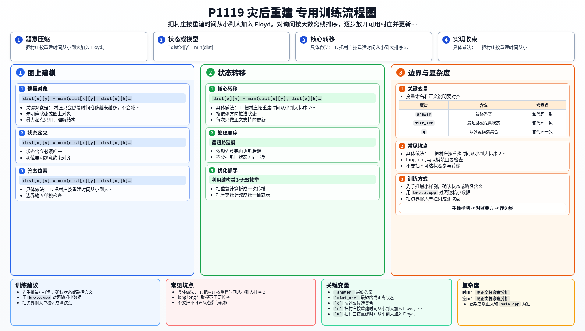

[[TOC]]

### 题意

每个村庄有一个重建完成时间 `t_i`。  
只有在第 `t` 天已经重建完成的村庄，才能作为路径中的点出现。

对于每个询问 `(x, y, t)`，要求回答：

- 在第 `t` 天，从 `x` 到 `y` 的最短路长度

如果 `x` 或 `y` 当天还没修好，或者虽然修好了但仍然无法连通，就输出 `-1`。

### 思路

先看一个最直接的小数据暴力：

@include-code(./brute.cpp, cpp)

暴力做法就是：

1. 对每个询问单独建一张“当天可用村庄”的图
2. 再做一次 Floyd
3. 回答该询问

这样写最贴近题意，但询问很多时会重复做大量相同工作。

关键观察是：

- 村庄只会随着时间推移越来越多，不会减少

这说明我们可以把所有询问按时间排序，  
然后像“慢慢开点”一样维护 Floyd。

具体做法：

1. 把村庄按重建时间从小到大排序
2. 把所有询问也按 `t` 从小到大排序
3. 维护一个指针 `ptr`
4. 当处理某个询问时间 `t` 时，把所有 `build_time <= t` 的村庄依次加入
5. 每加入一个新村庄 `k`，就做一轮 Floyd 的转移：
   - `dist[x][y] = min(dist[x][y], dist[x][k] + dist[k][y])`

这样，当处理到时间 `t` 的查询时，矩阵里保存的正好就是：

- 只允许使用“重建时间不超过 `t` 的村庄”时的最短路

最后还要额外判断：

- `x` 是否已修好
- `y` 是否已修好

因为即使矩阵里有数值，如果端点当天本身还没开放，也不能通车。

### 代码

@include-code(./main.cpp, cpp)

### 复杂度

每个点至多被加入一次，每次加入做一轮 Floyd：

- `O(N^3)`

排序询问：

- `O(Q log Q)`

总复杂度：

- `O(N^3 + Q log Q)`

在 `N <= 200` 的范围内完全可行。

空间复杂度：

- `O(N^2)`

### 总结

这题的关键不是普通 Floyd，而是“按时间加点”的思路。

只要看出：

- 可用点集合会随时间单调增加

就可以把查询离线排序，再把 Floyd 的中转点按重建时间逐步放开。  
这是很典型的“动态开点 + 离线 Floyd”模型。

### 一图流解析

这张图把本题的建模、关键转移、实现检查和训练方法压缩到一页，适合读完正文后复盘。

