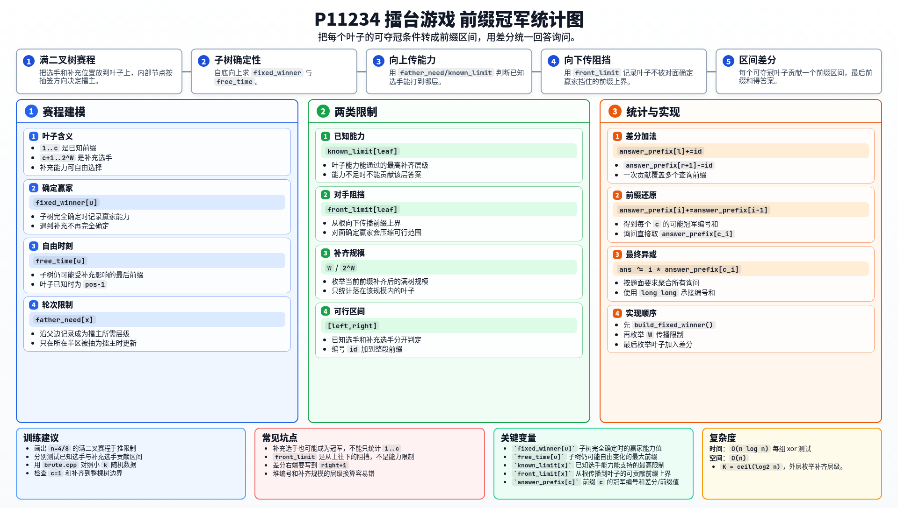

[[TOC]]

### 题意

有 `n` 位已报名选手，第 `i` 位选手编号为 `i`，能力为 `a_i`。对某个前缀 `c`，只收到前 `c` 位选手，需要补充最少的人，使总人数变成 `2` 的幂。

比赛是固定赛程的淘汰赛。每场比赛会指定左边或右边的胜者作为擂主。若擂主能力至少为当前轮次，擂主获胜；否则另一方获胜。

补充选手能力可以任意选择。如果补充选手可能成为冠军，也要计入答案。对每个询问 `c_i`，求所有可能冠军编号之和，最后按题目要求输出加权 xor。

### 思路

先看一个小数据暴力：对补充选手枚举能力值，再模拟整棵比赛树，收集所有可能冠军。

@include-code(./brute.cpp, cpp)

补充选手能力超过总轮数 `K` 后没有区别，所以暴力只枚举 `0..K`。但补充人数可能很多，仍然是指数级。

正解把赛程看成一棵满二叉树。叶子是选手编号，内部结点是一场比赛。对某个前缀 `c`，前 `c` 个叶子是已知选手，后面的叶子是补充选手。

我们希望反过来统计：每个叶子在哪些前缀长度下可能成为冠军。若一个编号 `id` 能在前缀区间 `[l,r]` 中成为冠军，就把 `id` 加到这个区间上。最后对差分数组做前缀和，就得到每个 `c` 的答案。

需要维护几个树上信息：

| 变量 | 含义 |
| --- | --- |
| `fixed_winner[u]` | 子树 `u` 完全确定时，最终赢家的能力 |
| `free_time[u]` | 子树 `u` 最后仍可能受补充选手影响的前缀位置 |
| `known_limit[leaf]` | 已知选手能力能支持它通过的最高补齐层级 |
| `front_limit[leaf]` | 从根往下看，这个叶子不被确定赢家挡住的最大前缀 |

`fixed_winner` 和 `free_time` 可以自底向上计算。叶子如果是已知选手，它在前缀达到自己之前还不可用，所以自由时刻是 `pos - 1`；补充叶子一直可以自由选择能力。

`known_limit` 处理的是已知选手自身能力够不够。沿着叶子到根的路径，如果它所在的一侧被抽为擂主，就必须满足对应轮次的能力要求。

`front_limit` 处理的是“会不会被对面确定赢家挡住”。对每个补齐规模 `2^W`，从对应子树根向下传播限制：若某一侧确定赢家已经足够赢当前轮，就会压缩另一侧叶子的可行前缀范围。

最后枚举补齐规模 `W` 和叶子：

- 如果叶子是已知选手，且 `known_limit` 支持它打到这一层，就把它能成为冠军的前缀区间加入差分；
- 如果叶子是补充选手，只要它所在位置在当前前缀之后，且没有被 `front_limit` 挡住，也把它的前缀区间加入差分。

对差分数组做前缀和后，`answer_prefix[c]` 就是前缀 `c` 的可能冠军编号和。

### 代码

@include-code(./main.cpp, cpp)

### 复杂度

设 `K = ceil(log2 n)`。每组 xor 测试数据的复杂度为 `O(n log n)`，空间复杂度为 `O(n)`。

### 总结

这题难点不是模拟比赛，而是同时处理所有前缀。核心做法是把“某个选手能否夺冠”转成“某个叶子在哪些前缀中可行”，再用差分统一统计。

树上自底向上的 `fixed_winner/free_time` 负责确定子树信息，自顶向下的 `front_limit` 负责传播阻挡条件。两部分合起来，就能得到每个叶子的可行前缀区间。

### 一图流解析

这张图把本题的建模、关键转移、实现检查和训练方法压缩到一页，适合读完正文后复盘。

