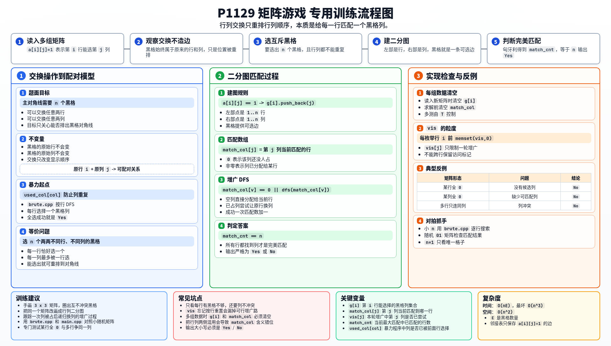

[[TOC]]

### 题意

给定一个 `n x n` 的 `01` 矩阵，其中 `1` 表示黑格，`0` 表示白格。

你可以进行两种操作：

- 交换任意两行
- 交换任意两列

问能否经过若干次操作后，让主对角线上的 `n` 个位置全部变成黑格。

### 思路

先看一个可以直接验证想法的朴素解：

@include-code(./brute.cpp, cpp)

`brute.cpp` 按行依次选择黑格，并保证列不重复。  
只要能给每一行都选到一个互不冲突的列，就说明存在一组黑格能放上主对角线。

这个暴力已经抓住了题目的本质，但它还是回溯搜索，数据一大就会超时。

真正的关键是看清“交换”到底改变了什么。

一个黑格原来在第 `i` 行、第 `j` 列。无论怎么交换：

- 它始终属于“原来的第 `i` 行”
- 也始终属于“原来的第 `j` 列”

交换操作只是在重新排列行和列的顺序，并不会创造新的“行和列的可配对关系”。

所以题目其实是在问：

- 能不能从矩阵里选出 `n` 个黑格
- 它们两两不在同一行，也不在同一列

一旦能选出这 `n` 个黑格，就可以把对应的行和列重新排列，把它们送到主对角线上。

这时模型就非常明显了：

- 左边放 `n` 个“行”
- 右边放 `n` 个“列”
- 如果 `a[i][j] = 1`，就在第 `i` 行和第 `j` 列之间连一条边

于是问题变成：

- 是否存在一个大小为 `n` 的二分图匹配

也就是是否存在完美匹配。

实现上直接使用 DFS 版匈牙利算法：

- 枚举每一行，尝试给它找一个列
- 如果目标列已经被别的行占了，就递归尝试让那一行换到别的列
- 最终如果匹配数等于 `n`，答案就是 `Yes`

### 代码

@include-code(./main.cpp, cpp)

### 复杂度

- 设黑格总数为 `E`
- 时间复杂度：`O(nE)`，最坏为 `O(n^3)`
- 空间复杂度：`O(n^2)`

### 总结

这题最重要的不是匹配模板本身，而是先完成这一步转化：

- 从“交换行列”转成“挑选互不冲突的黑格”

一旦看出题目本质是在给“行”和“列”做一一配对，就可以自然地建成二分图最大匹配。

### 一图流解析

这张图把本题的建模、匹配过程、实现检查和训练方法压缩到一页，适合读完正文后复盘。

