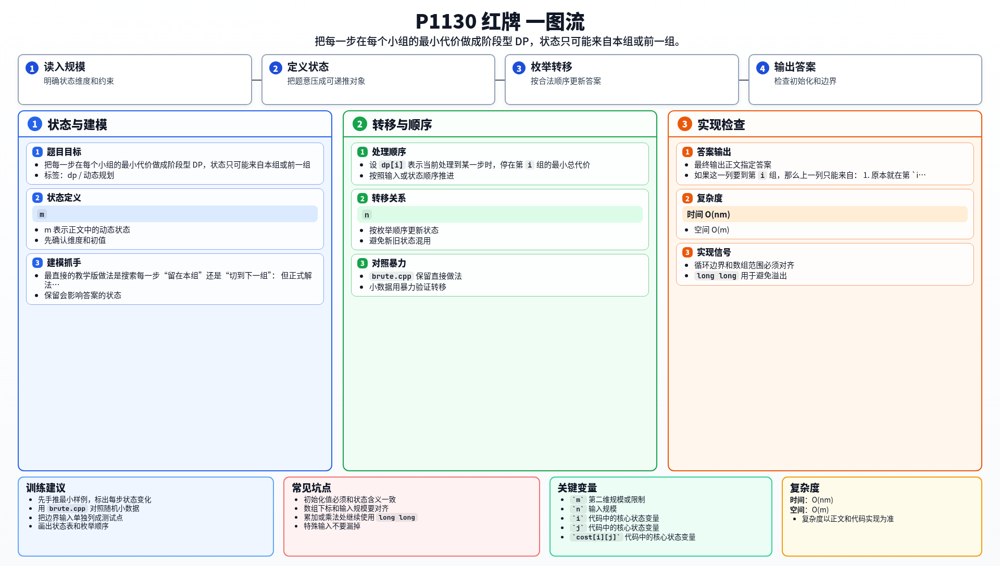

[[TOC]]

### 题意

有 `m` 个小组，要完成 `n` 个步骤。

第 `i` 组做第 `j` 步需要 `cost[i][j]` 天。

每一步你可以：

- 继续留在当前组；
- 或在相邻两步之间切换到下一组（`m` 的下一组视作 `1`）。

要求求出完成全部步骤的最小总代价。

### 思路

最直接的教学版做法是搜索每一步“留在本组”还是“切到下一组”：

@include-code(./brute.cpp, cpp)

但正式解法用 DP 更自然。

设 `dp[i]` 表示当前处理到某一步时，停在第 `i` 组的最小总代价。

如果这一列要到第 `i` 组，那么上一列只能来自：

1. 原本就在第 `i` 组；
2. 原本在第 `i` 的前一个组，然后本步切换过来。

所以转移是：

`new_dp[i] = min(dp[i], dp[prev(i)]) + cost[i][step]`

第一步可以任选小组，因此直接初始化为第一列代价。

#### DP 公式

设 $dp_i$ 表示处理完当前步骤后停在第 $i$ 组的最小总代价。第一步初始化为：

$$
dp_i=cost_{i,1}
$$

第 $step$ 步的转移是：

$$
new\_dp_i=\min(dp_i,\ dp_{prev(i)})+cost_{i,step}
$$

其中：

$$
prev(i)=\begin{cases}
m, & i=1,\\
i-1, & i>1.
\end{cases}
$$

最终答案为：

$$
\min_{1\le i\le m} dp_i
$$

公式解释：第 `step` 步停在第 `i` 组时，上一刻只能已经在第 `i` 组，或者从环上的前一组转过来。两者取较小值后再加上当前组完成这一步的代价，就得到新的最小总代价。

### 代码

@include-code(./main.cpp, cpp)

### 复杂度

- 时间复杂度：`O(nm)`
- 空间复杂度：`O(m)`

### 总结

这题的本质是一个很标准的“按列推进”的阶段型 DP。

关键只在于看清楚：每个状态的来源永远只有两个。

### 一图流解析

这张图把本题的建模、关键转移、实现检查和训练方法压缩到一页，适合读完正文后复盘。

