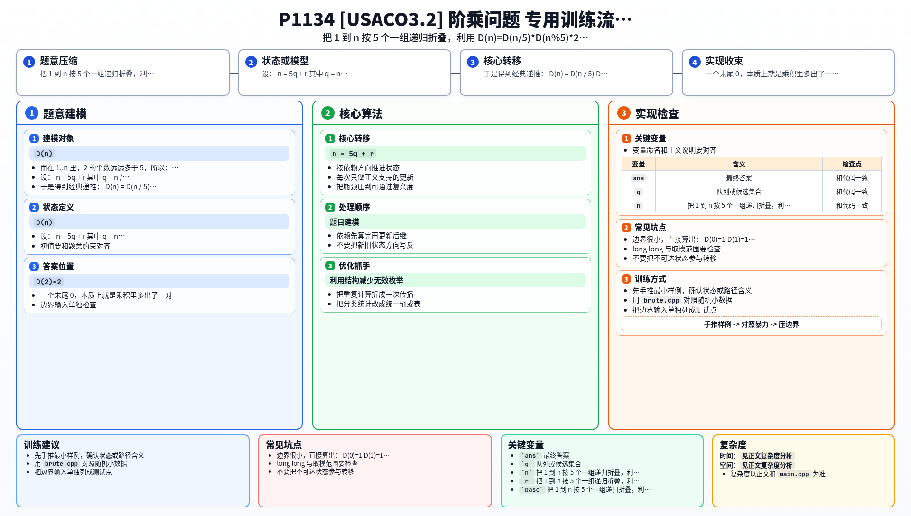

[[TOC]]

### 题意

给定一个 `n`，要求输出 `n!` 的最右边那个非零数字。

例如：

- `12! = 479001600`
- 去掉末尾的两个 `0` 后，最后一位是 `6`

注意这里不是求 `n!` 的最后一位，而是要先把末尾所有 `0` 去掉，再看最后一位是什么。

### 思路

先看一个最直接的小数据暴力：

@include-code(./brute.cpp, cpp)

`brute.cpp` 的做法是从 `1` 一直乘到 `n`，每乘一次就把末尾的 `0` 删掉，同时只保留一部分低位，防止数字过大。

这个思路很好理解，但时间复杂度是 `O(n)`。题目里的 `n` 最大到 `5 * 10^7`，这样做显然太慢。

#### 关键观察：末尾的 `0` 来自 `2 * 5`

一个末尾 `0`，本质上就是乘积里多出了一对 `2` 和 `5`。

而在 `1..n` 里，`2` 的个数远远多于 `5`，所以：

- 末尾有多少个 `0`
- 本质上由多少个 `5` 决定

所以这题最关键的不是把整个阶乘真的算出来，而是想办法把所有 `5` 对应的影响单独拿出来处理。

#### 把 `1..n` 按 `5` 个一组

设：

- `n = 5q + r`
- 其中 `q = n / 5`
- `r = n % 5`

那么 `1..n` 可以看成：

- 前面 `q` 组完整的 `5` 个数
- 最后剩下 `r` 个零头

所有 `5` 的倍数是：

`5, 10, 15, ..., 5q`

把这些数里的一个因子 `5` 提出来之后，就变成：

`1, 2, 3, ..., q`

这就是为什么递归里会出现 `q!`，也就是 `D(q)`。

另一方面，每提走一个 `5`，就要配走一个 `2` 形成一个末尾 `0`。  
由于这样的完整组一共有 `q` 个，所以还会额外留下一个因子：

`2^q`

最后那 `r` 个零头数，对答案的贡献 just 和 `r!` 的最右非零位一样，也就是 `D(r)`。

于是得到经典递推：

`D(n) = D(n / 5) * D(n % 5) * 2^(n / 5) mod 10`

其中 `D(n)` 表示 `n!` 的最右非零位。

边界很小，直接算出：

- `D(0)=1`
- `D(1)=1`
- `D(2)=2`
- `D(3)=6`
- `D(4)=4`

这样就可以递归求解了。每次都会把 `n` 变成 `n/5`，所以层数非常少。

### 代码

@include-code(./main.cpp, cpp)

### 复杂度

- 时间复杂度：`O(log_5 n)`
- 空间复杂度：`O(log_5 n)`（递归栈）

### 总结

这题的难点不在实现，而在把“阶乘末尾非零位”转成一个数论递推。

核心记忆点只有两个：

1. 末尾 `0` 来自 `2 * 5`，真正稀缺的是 `5`
2. 按 `5` 个一组后，可以把问题递归折叠成 `n/5`

一旦推出

`D(n) = D(n / 5) * D(n % 5) * 2^(n / 5) mod 10`

这题就只剩下一个很短的递归实现。

### 一图流解析

这张图把本题的建模、关键转移、实现检查和训练方法压缩到一页，适合读完正文后复盘。

