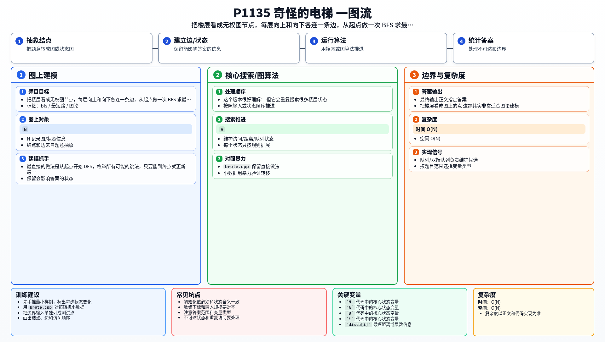

[[TOC]]

### 题意

有一栋楼一共 `N` 层，电梯一开始在 `A` 楼，目标是到 `B` 楼。

在第 `i` 层时，电梯只能尝试两种移动：

- 上到 `i + K_i`
- 下到 `i - K_i`

如果超出 `1..N` 范围，对应按钮就失灵。

要求输出从 `A` 到 `B` 最少要按几次按钮；如果到不了，输出 `-1`。

### 思路

最直接的做法是从起点开始 DFS，枚举所有可能的跳法，只要能到终点就更新最优答案。

这个版本很好理解：

@include-code(./brute.cpp, cpp)

但它会重复搜索很多楼层状态。

#### 把楼层看成图上的点

这题其实非常适合图论建模。

把每一层看成一个点，那么从第 `i` 层最多能向两个点连边：

- `i + K_i`
- `i - K_i`

而每按一次按钮，代价都相同，都是 `1`。

于是整题就变成了：

无权图最短路。

#### 为什么 BFS 就够了

在无权图中，BFS 会按距离从小到大扩展节点。

所以某层楼第一次被访问到时，当前记录的按钮次数就是到它的最少次数。

对于这题来说，每层最多只有两条出边，写起来也很简单。

#### 正式做法

1. 建一个 `dista[i]`，记录起点到第 `i` 层的最少按钮次数；
2. 初始全部设为 `-1`；
3. 起点入队，距离设为 `0`；
4. 每次弹出当前楼层，尝试上下两个跳法；
5. 若目标楼层第一次被访问到，答案就是它的距离。

### 代码

@include-code(./main.cpp, cpp)

### 复杂度

- 时间复杂度：`O(N)`
- 空间复杂度：`O(N)`

### 总结

这题是一个很标准的“建图 + BFS”入门题。

只要看出“每层是点、按钮是边、每次代价都一样”，就能直接套无权图最短路模板。

### 一图流解析

这张图把本题的建模、关键转移、实现检查和训练方法压缩到一页，适合读完正文后复盘。

