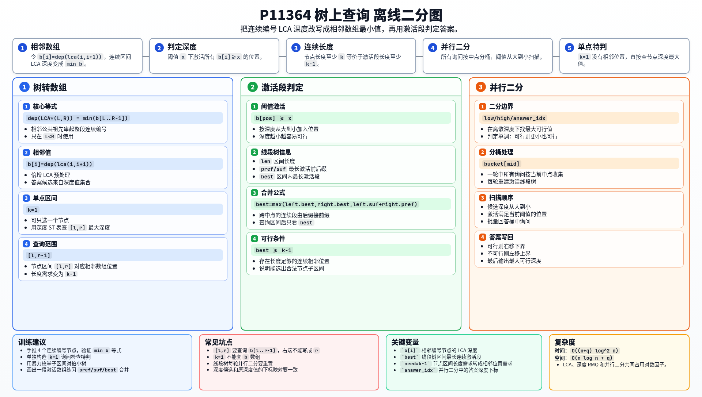

[[TOC]]

### 题意

给定一棵以 `1` 为根的树，节点编号为 `1..n`。节点深度定义为从根到该节点路径上的节点数量。

`LCA*(l, r)` 表示编号在 `[l, r]` 内所有节点的最近公共祖先。每次询问给出 `l, r, k`，要在 `[l, r]` 的所有长度至少为 `k` 的连续编号子区间 `[l', r']` 中，求 `dep(LCA*(l', r'))` 的最大值。

如果 `k = 1`，可以只选一个节点，答案就是编号区间 `[l, r]` 内节点深度的最大值。

### 思路

先看一个可以直接验证想法的朴素解：

@include-code(./brute.cpp, cpp)

暴力做法会枚举每个询问里的所有连续子区间，再逐个求这些节点的 LCA。这个思路非常直观，但一个询问就可能有二次方个子区间，无法处理 `5 * 10^5` 的数据范围。

关键是把“连续编号节点的 LCA”变成一个数组问题。定义：

```text
b[i] = dep(lca(i, i + 1))  (1 <= i < n)
```

对于长度大于 `1` 的连续编号区间 `[L, R]`，有：

```text
dep(LCA*(L, R)) = min(b[L], b[L + 1], ..., b[R - 1])
```

这张表展示节点区间和 `b` 数组区间之间的对应关系：

| 节点区间 | 对应的 `b` 数组位置 | LCA 深度 |
| --- | --- | --- |
| `[L, L]` | 无 | `dep[L]` |
| `[L, L + 1]` | `b[L]` | `b[L]` |
| `[L, R]` | `b[L..R-1]` | `min(b[L..R-1])` |

表里最重要的是第三行：长度大于 `1` 的节点区间不再直接看所有节点，而是看相邻编号 LCA 深度数组的一段最小值。相邻位置能串起整个连续编号区间，所以只要每一对相邻节点在某个深度处仍有共同祖先，整段节点也在这个深度处有共同祖先。

于是当 `k >= 2` 时，询问 `[l, r, k]` 等价于：

```text
在 b[l..r-1] 中找一个长度至少为 k-1 的连续子段，
最大化这个子段的最小值。
```

对答案深度 `x` 做判定：把所有满足 `b[i] >= x` 的位置激活。若 `[l, r-1]` 内存在连续至少 `k-1` 个激活位置，就说明可以选出一个长度至少为 `k` 的节点区间，其 LCA 深度至少为 `x`。

这个判定对 `x` 单调，所以可以二分答案。为了同时处理所有询问，代码使用并行二分：每一轮把询问按当前二分中点分桶，然后按阈值从大到小扫描并激活位置。

线段树维护每个区间的四个量：

- `len`：区间长度；
- `pref`：最长激活前缀；
- `suf`：最长激活后缀；
- `best`：区间内最长连续激活段。

合并两个线段树节点时，跨过中点的连续激活段长度是左儿子的 `suf + 右儿子的 pref`。查询 `[l, r-1]` 后，如果 `best >= k-1`，当前二分值可行。

`k = 1` 的询问单独处理：预处理节点深度的 ST 表，直接查询编号区间 `[l, r]` 内最大深度。

### 代码

@include-code(./main.cpp, cpp)

### 复杂度

LCA 倍增预处理和深度 ST 表都是 `O(n log n)`。

并行二分有 `O(log n)` 轮，每轮线段树激活位置和回答询问的总复杂度为 `O((n + q) log n)`，所以总时间复杂度为：

```text
O((n + q) log^2 n)
```

空间复杂度为 `O(n log n + q)`。

### 总结

本题最关键的一步是发现连续编号区间 `[L, R]` 的 LCA 深度等于相邻数组 `b[L..R-1]` 的最小值。这样原来的树上区间 LCA 查询就转成了“区间中是否存在足够长的连续可行段”。

`k = 1` 要单独处理，因为单点区间没有相邻数组位置。`k >= 2` 时，用离线二分答案和线段树维护连续激活段，就可以批量回答所有询问。

### 一图流解析

这张图把本题的建模、关键转移、实现检查和训练方法压缩到一页，适合读完正文后复盘。


