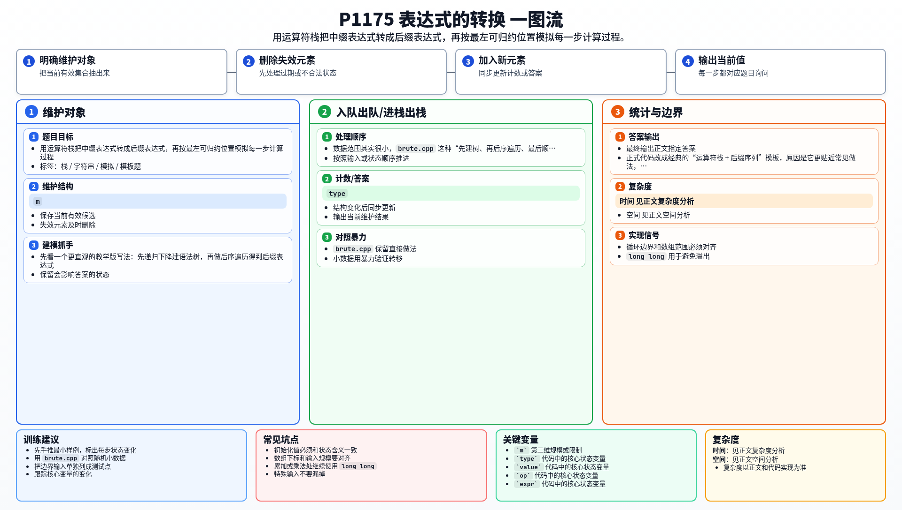

[[TOC]]

### 题意

给定一个中缀表达式，先把它转换成后缀表达式并输出。  
然后继续在这个后缀表达式上做“演示式计算”：

- 每次都找当前序列里最靠左的运算符；
- 用它前面的两个数字计算出结果；
- 再用这个结果替换掉这三个位置；
- 每做完一步就把当前序列输出出来。

题目的难点不在算值本身，而在于两件事：

1. 中缀转后缀时要正确处理优先级、括号和 `^` 的右结合。
2. 输出过程时不能只保留一个求值栈，而要真的维护“当前后缀序列”。

### 思路

先看一个更直观的教学版写法：先递归下降建语法树，再做后序遍历得到后缀表达式。

@include-code(./brute.cpp, cpp)

这题数据范围其实很小，`brute.cpp` 这种“先建树、再后序遍历、最后顺序模拟”的写法已经可以通过。  
正式代码改成经典的“运算符栈 + 后缀序列”模板，原因是它更贴近常见做法，也更方便以后复用。

核心分两步。

#### 第一步：中缀转后缀

扫描原串时分三类处理：

- 数字：直接放进后缀序列。
- 左括号：直接入栈。
- 右括号：一直弹栈，直到遇到左括号。
- 普通运算符：比较它和栈顶运算符的优先级。

对于左结合运算符 `+ - * /`，如果栈顶优先级更高，或者相同，就要先把栈顶弹出。  
但 `^` 是右结合，所以当前运算符也是 `^` 时，遇到同优先级的 `^` 不能弹。

#### 右结合为什么要特判

这张表展示样例 `2^2^3` 在转后缀时，运算符栈和后缀序列的变化。

| 读入内容 | 运算符栈 | 后缀序列 |
| --- | --- | --- |
| `2` | 空 | `2` |
| `^` | `^` | `2` |
| `2` | `^` | `2 2` |
| `^` | `^ ^` | `2 2` |
| `3` | `^ ^` | `2 2 3` |
| 扫描结束 | 空 | `2 2 3 ^ ^` |

如果这里把“同优先级也弹出”写死，那么会得到 `2 2 ^ 3 ^`，含义就变成了 `(2^2)^3`。  
所以 `^` 必须单独按右结合处理，这是这题最容易写错的地方。

#### 第二步：按题意模拟每一步计算

后缀表达式求值本来只要一个栈，但那样只能得到最终答案，不能输出中间序列。  
因此这里要维护一个数组，表示“当前还没完全化简完的后缀表达式”。

每次操作：

1. 从左到右找到第一个运算符；
2. 它前面两个位置一定是本次要参与运算的数字；
3. 算出结果后，用结果替换这三个位置；
4. 输出替换后的整个序列。

为什么“第一个运算符”一定可算？  
因为合法的后缀表达式里，最左边第一个出现的运算符，前面必然已经形成了两个完整操作数。这正好对应一次最早能发生的归约。

中缀转后缀这一部分的栈处理思路，可以参考 rbook 里的文章：[表达式求值](https://rbook2.roj.ac.cn/data-structure/stack/%E8%A1%A8%E8%BE%BE%E5%BC%8F/index.html)。

### 代码

@include-code(./main.cpp, cpp)

### 复杂度

- 设拆分后的记号个数为 `m`。
- 中缀转后缀只扫描一遍，时间复杂度是 `O(m)`。
- 模拟输出阶段每次删除 3 个记号、插回 1 个记号，需要在线性表里移动元素，总复杂度是 `O(m^2)`。
- 空间复杂度是 `O(m)`。

### 总结

这题真正要掌握的是两个点：

1. 中缀转后缀时，`^` 和其他运算符的结合性不同。
2. 题目要求输出每一步过程，所以不能只做“普通后缀求值”，还要显式维护当前序列。

如果以后再遇到“表达式转换”类题目，中缀转后缀的部分几乎可以直接复用。

### 一图流解析

这张图把本题的建模、关键转移、实现检查和训练方法压缩到一页，适合读完正文后复盘。

