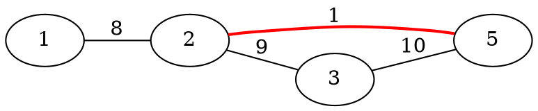

[[TOC]]

### 题意

给你一张无向带权图，起点是 `1`，终点是 `N`。

现在有一条路会因为维修而完全不能走，但不知道具体是哪一条。  
题目保证：无论封掉哪条边，从 `1` 仍然能到 `N`。

玛丽卡会在剩下的边里重新走最短路。  
要求输出最糟糕情况下，这条最短路会变成多长。

#### 样例直觉图

这张图展示了“封掉原最短路上的一条边后，被迫绕路”的现象：

如果红边 `2-5` 被封掉，原来的最短路就失效了，只能走更长的替代路线。  
所以关键不在“封哪条边”，而在“哪些边真的有能力把当前最短路挤掉”。

### 思路

先看一个最直接的小数据暴力：

@include-code(./brute.cpp, cpp)

暴力做法就是：

1. 枚举每一条边
2. 把它临时删掉
3. 重算 `1 -> N` 的最短路
4. 取这些最短路里的最大值

这个做法最贴题意，但把所有边都删一遍没有必要。

关键观察和 `P2176` 很像：

- 如果某条边不在我们当前求出的一条最短路上
- 那么把它封掉之后，这条最短路本身仍然完整存在

既然原来的这条最短路还在，那么新的最短路长度就不可能变大。  
所以只有一类边值得枚举：

- 某条已知最短路上的边

于是正式做法变成：

1. 第一次 Dijkstra，求出从 `1` 到 `N` 的一条最短路
2. 记录每个点的前驱点和前驱边
3. 从 `N` 倒着回溯，恢复出这条最短路上的所有边编号
4. 依次禁用这些边，再跑一次 Dijkstra
5. 取得到的最短路长度最大值

和代码的对应关系：

- `parent_node`、`parent_edge`：第一次最短路时记录路径
- `path_edges`：回溯出的那条最短路
- `banned_id`：当前被封掉的边
- `dijkstra(1, false, banned_id)`：忽略这条边重新算最短路

### 代码

@include-code(./main.cpp, cpp)

### 复杂度

设回溯出的这条最短路有 `L` 条边。

第一次 Dijkstra：

- `O(M log N)`

之后最多再跑 `L` 次 Dijkstra，而 `L <= N-1`，所以总复杂度是：

- `O(N * M log N)`

空间复杂度：

- `O(N + M)`

### 总结

这题的核心不是“删边后重跑最短路”，而是先缩小枚举范围。

只要想清楚：

- 不在某条已知最短路上的边，被删掉后不可能让答案变差

那么就只需要关心那条最短路上的边，后面的实现就是标准的：

- 路径恢复
- 枚举删边
- 重跑 Dijkstra
