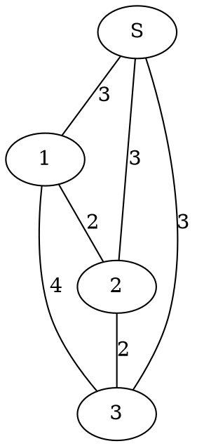

[[TOC]]

### 题意

有 `B` 件礼物，每件礼物如果直接买都要 `A` 元。

但如果已经买过第 `i` 件，再买第 `j` 件，就可以用优惠价 `K[i][j]` 购买，而且同时有多个优惠时可以选最便宜的那个。

问把所有礼物都买下来，最少要花多少钱。

#### 样例图

这张图把样例 2 画成“虚拟源点 + 礼物点”的形式：

先直接买第 `2` 件礼物花 `3` 元，再通过优惠买 `1` 和 `3` 各花 `2` 元，总价就是 `7`。
从这张图也能看出来，这正好对应选了一棵最便宜的连通结构。

### 思路

先看一个直接按购买顺序做的小数据暴力：

@include-code(./brute.cpp, cpp)

暴力用状压 DP 表示“已经买了哪些礼物”：

- 如果下一件礼物直接买，花 `A`
- 如果已经买过一些礼物，就可以从这些礼物里挑一个最便宜优惠价

这个思路很好理解，但礼物数一大就不能状压了。

关键观察是：每件礼物最终都要以某种方式“接入”已经买过的集合里，而这个接入方式只有两类：

1. 直接原价买，代价是 `A`
2. 通过某件已买礼物的优惠接进来，代价是 `K[i][j]`

于是可以加一个虚拟源点 `S`：

- `S -> i` 连一条权值为 `A` 的边，表示“第 `i` 件礼物直接买”
- 礼物 `i` 和礼物 `j` 之间连一条权值 `K[i][j]` 的边，表示“通过优惠买”

这样，想把所有礼物都买到手，就等价于：

> 从虚拟源点出发，把所有礼物点连起来，并让总边权最小。

这就是最小生成树。

因为输入本身就是一个完整矩阵，直接写 `Prim` 最自然：

1. 初始时，所有礼物到生成树的代价都设成 `A`
2. 每次选一个当前最便宜接入的礼物
3. 再用它的优惠价更新其它礼物的接入代价

### 代码

@include-code(./main.cpp, cpp)

### 复杂度

设礼物数量为 `B`。

Prim 每次找一个新点，再扫一整行更新最优接入代价：

- 时间复杂度 `O(B^2)`
- 空间复杂度 `O(B^2)`

### 总结

这题最重要的一步，是把“直接买”也看成一种边。只要想到加一个虚拟源点，把原价 `A` 变成源点到每件礼物的边，原题就会很自然地落到最小生成树上。
