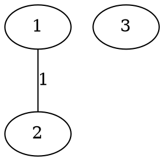
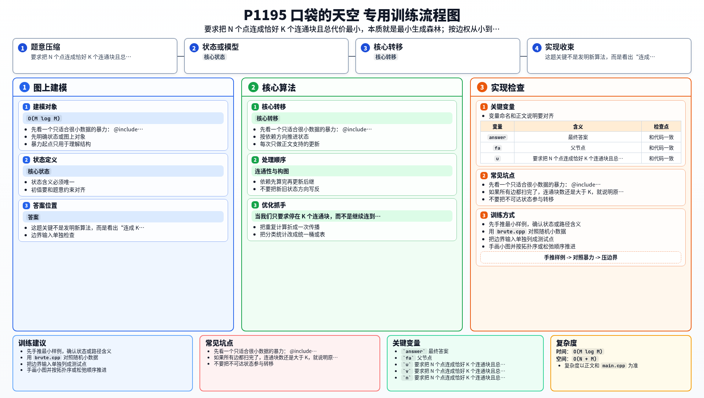

[[TOC]]

### 题意

给一张无向带权图，要从中选出一些边，把所有点连成恰好 `K` 个连通块，并让总代价最小。

如果无论怎么选都做不到恰好 `K` 个连通块，就输出 `No Answer`。

#### 样例图

这张图把样例画出来：

原图一共有 `3` 个点，只有一条边 `1-2`，目标是连成 `2` 个连通块。
选上这条边后，连通块从 `{1},{2},{3}` 变成 `{1,2},{3}`，刚好是 `2` 块，总代价是 `1`。

### 思路

先看一个只适合很小数据的暴力：

@include-code(./brute.cpp, cpp)

暴力直接枚举所有边子集：

- 如果子集里形成了环，就不是最优结构，跳过
- 统计最后有多少个连通块
- 只保留恰好 `K` 个连通块的方案，取最小代价

这个思路按定义是对的，但边数一大就完全不可行。

这题本质上就是最小生成树的一个变形。

普通最小生成树是：

- 从 `N` 个单点开始
- 按边权从小到大连边
- 一直连到只剩 `1` 个连通块

而这题只是把终点改成：

- 一直连到只剩 `K` 个连通块

所以可以直接套 Kruskal：

1. 把所有边按权值升序排序
2. 用并查集维护当前连通块
3. 每次选一条能连接两个不同连通块的最小边
4. 当连通块数降到 `K` 时立即停止

为什么这样就是最优？

因为 Kruskal 在任何时刻都优先用最便宜的边去合并两个块。
当我们只要求停在 `K` 个连通块，而不是继续连到 `1` 个时，前面的贪心理由完全不变。

如果所有边都扫完了，连通块数还是大于 `K`，就说明原图本身不够连通，答案不存在，输出 `No Answer`。

### 代码

@include-code(./main.cpp, cpp)

### 复杂度

设点数为 `N`，边数为 `M`。

Kruskal 的复杂度是：

- 排序 `O(M log M)`
- 并查集合并 `O(M \alpha(N))`

总时间复杂度 `O(M log M)`，空间复杂度 `O(N + M)`。

### 总结

这题关键不是发明新算法，而是看出“连成 `K` 块”的要求，正好就是把最小生成树的终止条件从 `1` 个连通块改成 `K` 个连通块。识别成最小生成森林以后，代码就很直接了。

### 一图流解析

这张图把本题的建模、关键转移、实现检查和训练方法压缩到一页，适合读完正文后复盘。

