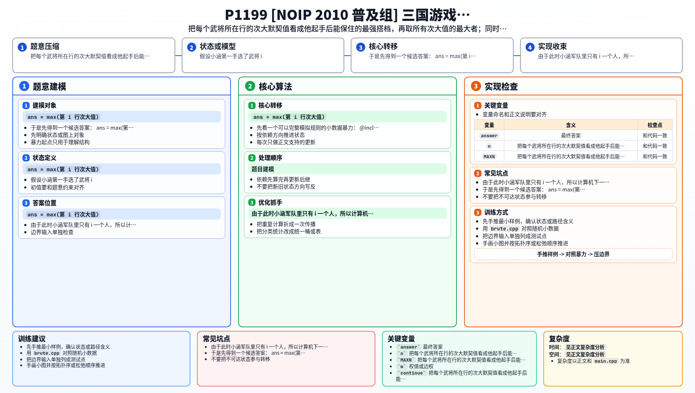

[[TOC]]

### 题意

有 `n` 个武将，任意两人之间都有一个互不相同的默契值。

小涵和计算机轮流选将，小涵先手。  
计算机每次都会按题目指定的贪心策略，优先抢走最能破坏小涵下一步最强组合的那个自由武将。

所有武将被平分后，双方各自在自己军队里选出默契值最高的一对武将出战，默契值更大的一方获胜。

要求判断：

1. 小涵是否一定能赢
2. 如果能赢，在所有可能胜利结局中，小涵那对出战武将的最大默契值是多少

### 思路

先看一个可以完整模拟规则的小数据暴力：

@include-code(./brute.cpp, cpp)

暴力会枚举小涵每一步选谁，计算机则按题意固定回应，最后比较双方最强二人组。
它只能用于很小的数据，但很适合帮我们验证结论。

#### 第一步：固定第一手看会发生什么

假设小涵第一手选了武将 `i`。

由于此时小涵军队里只有 `i` 一个人，所以计算机下一手一定会：

- 在所有自由武将里找一个和 `i` 默契值最大的
- 然后把它抢走

这就意味着：

- `i` 最好的搭档一定被破坏
- 小涵围绕 `i` 还能保住的最好搭档，只能是第二好的那个

所以对每个武将 `i`，只要看它这一行里的：

- 最大值
- 次大值

其中次大值，就是“小涵如果第一手拿 `i`，最终至少能保住的最好组合值”。

于是先得到一个候选答案：

`ans = max(第 i 行次大值)`

#### 第二步：为什么这个值一定能赢

关键性质是：

- 所有 **严格大于 `ans`** 的边，一定构成一个匹配

原因很简单：  
如果某个点连出去有两条边都大于 `ans`，那么这个点所在行的次大值也会大于 `ans`，这和 `ans` 的定义矛盾。

既然这些高边构成匹配，那么在选将过程中：

- 计算机一次最多只能拿走某条高边的一个端点
- 小涵总能在自己的下一步把对应的另一个端点拿走

所以计算机最终不可能同时拥有某条高边的两个端点，
也就不可能形成默契值大于 `ans` 的组合。

而小涵只要从“次大值等于 `ans`”的那一行对应武将起手，
就能保证自己最后拿到一条默契值至少为 `ans` 的边。

因此：

- 小涵一定能赢
- 最大可保证值就是 `ans`

### 代码

@include-code(./main.cpp, cpp)

### 复杂度

- 时间复杂度：`O(n^2)`
- 空间复杂度：`O(n^2)`

### 总结

这题表面是博弈，真正的关键却是一个很短的图论结论：

1. 固定第一手后，计算机会破坏这一行最大值
2. 所以这一行能保住的是次大值
3. 所有超过全局答案的边会形成匹配，计算机拿不成完整的一条

所以最后答案就是：

- 所有行的次大值中的最大值

### 一图流解析

这张图把本题的建模、关键转移、实现检查和训练方法压缩到一页，适合读完正文后复盘。

