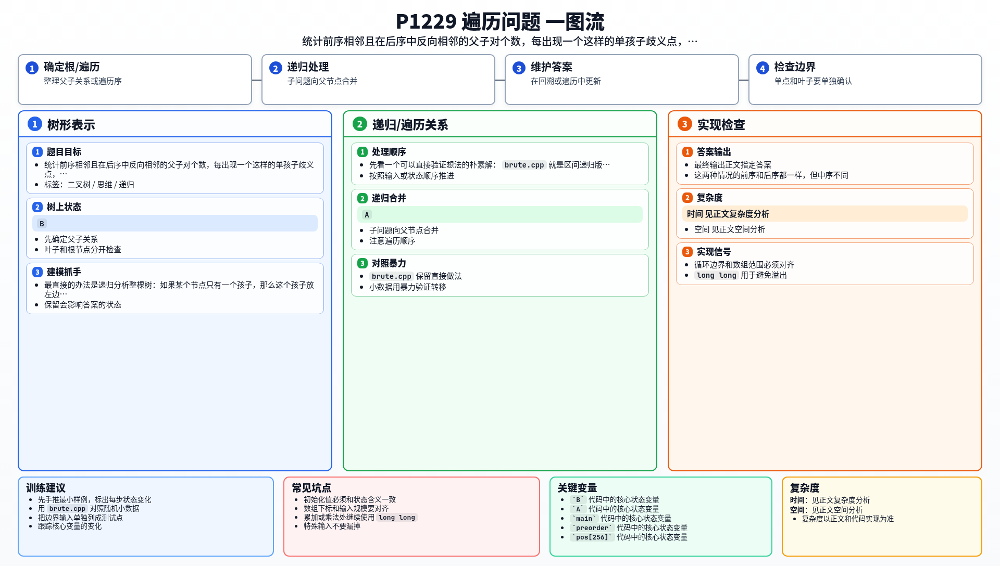

[[TOC]]

### 题意

给出一棵二叉树的前序遍历和后序遍历，要求统计可能有多少种不同的中序遍历。

### 思路

最直接的办法是递归分析整棵树：如果某个节点只有一个孩子，那么这个孩子放左边还是右边都行，方案数就乘 `2`。

先看一个可以直接验证想法的朴素解：

@include-code(./brute.cpp, cpp)

`brute.cpp` 就是区间递归版本，直接在结构层面统计“单孩子歧义点”的个数。

更关键的观察是，这种歧义点有一个非常直接的遍历特征：

- 在前序里相邻出现 `A B`
- 在后序里相邻出现 `B A`

#### 单孩子歧义

这张图展示一个只有一个孩子的节点为什么会带来两种中序：

在这棵树里，`B` 既可以是 `A` 的左孩子，也可以是右孩子。
这两种情况的前序和后序都一样，但中序不同。
所以每遇到一个这样的节点，答案就多乘一个 `2`。

于是正式解只需：

1. 预处理每个字符在后序中的位置
2. 枚举前序里每对相邻字符
3. 如果它们在后序里也正好反向相邻，就说明这里是一个歧义点
4. 答案乘 `2`

### 代码

@include-code(./main.cpp, cpp)

### 复杂度

预处理位置表和线性扫描都只要 `O(n)`，所以总时间复杂度是 `O(n)`，空间复杂度是 `O(1)` 或按字符集记作 `O(\Sigma)`。

### 总结

这题的核心不是“重建整棵树”，而是抓住“单孩子节点会让左右方向不确定”这一条规律。把这类歧义点数出来，答案自然就是若干个 `2` 的乘积。

### 一图流解析

这张图把本题的建模、关键转移、实现检查和训练方法压缩到一页，适合读完正文后复盘。

