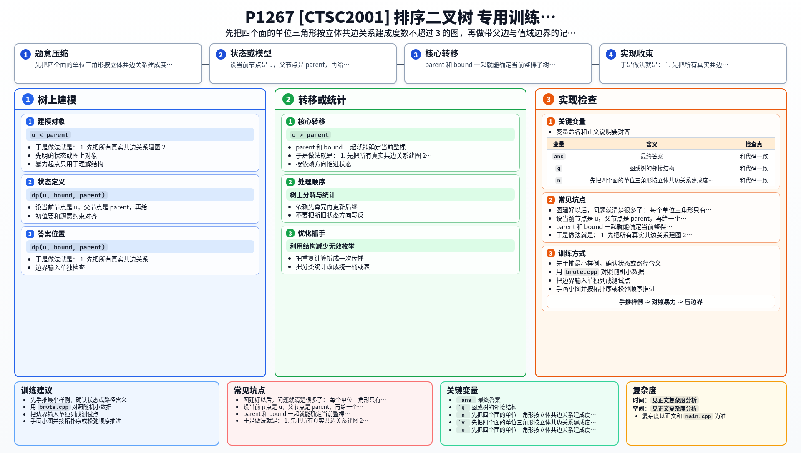

[[TOC]]

### 题意

把正三棱锥四个面上的所有单位三角形看成点。

如果两个单位三角形在真实立体结构中共边，就认为它们相邻。

现在每个点上放了一个互不相同的数，要求从中选出尽量多的点，组成一棵二叉搜索树，并满足：

- 父子节点必须相邻
- 左子树所有值小于根
- 右子树所有值大于根

输出最大节点数。

### 思路

先看一个可以直接验证想法的朴素解：

@include-code(./brute.cpp, cpp)

这题最麻烦的其实是第一步：把四个面折叠后的真实邻接关系建成图。

图建好以后，问题就清楚很多了：

- 每个单位三角形只有 3 个相邻点
- 如果当前点已经确定了父亲，那么最多只剩 2 个方向可以继续选儿子

这非常适合做 BST 型记忆化搜索。

设当前节点是 `u`，父节点是 `parent`，再给一个边界 `bound`。

`parent` 和 `bound` 一起就能确定当前整棵子树允许出现的值域：

- 如果 `u < parent`，说明当前子树在父亲的左边，值域是某个左区间
- 如果 `u > parent`，说明当前子树在父亲的右边，值域是某个右区间

这样转移时只需要看 `u` 的相邻点：

- 小于 `u` 且落在合法区间里的，才可能当左儿子
- 大于 `u` 且落在合法区间里的，才可能当右儿子

因为固定父边后最多只剩两个方向，所以左右子树可以独立取最优，然后加上当前节点。

于是做法就是：

1. 先把所有真实共边关系建图
2. 写 `dp(u, bound, parent)` 表示一个带父边和区间边界的最优子树
3. 枚举每个点作为整棵 BST 的根，取最大值

### 代码

@include-code(./main.cpp, cpp)

### 复杂度

总点数 `tot = 4n^2`。

状态数约为 `O(tot^2)`，每个状态只看常数个邻居。

所以时间复杂度：

`O(tot^2)`

空间复杂度：

`O(tot^2)`

### 总结

这题表面上是立体几何，真正的算法核心其实是：

- 先把几何问题翻译成小度数图
- 再利用 BST 的值域约束做区间型记忆化搜索

图一旦建对，后面的 DP 结构是很规整的。

### 一图流解析

这张图把本题的建模、关键转移、实现检查和训练方法压缩到一页，适合读完正文后复盘。

