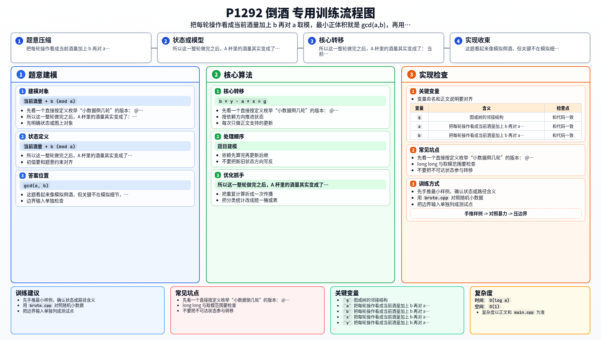

[[TOC]]

### 题意

有两个杯子，容量分别是 `a` 和 `b`，其中 `a >= b`。

只允许三种操作：

1. 从酒桶把 `B` 杯倒满
2. 把 `A` 杯倒空回酒桶
3. 把 `B` 杯往 `A` 杯里倒，直到 `B` 空或 `A` 满

要求让 `A` 杯里最后剩下的酒尽可能少，并输出这个最小正体积，以及对应需要做多少次：

- `A -> 桶`
- `桶 -> B`

### 思路

先看一个直接按定义枚举“小数据倒几轮”的版本：

@include-code(./brute.cpp, cpp)

这个朴素版没有真的去模拟所有细节，而是抓住了一个核心现象：

- 每做一轮“把 B 倒满，再尽量往 A 里倒”，本质上就是让 `A` 杯里的酒量加上一个 `b`

如果 `A` 满了，就必须把 `A` 倒空，再把 `B` 里剩下的继续倒进去。  
所以这一整轮做完之后，`A` 杯里的酒量其实变成了：

- `当前酒量 + b (mod a)`

也就是说，能在 `A` 杯里出现的酒量依次是：

- `b mod a`
- `2b mod a`
- `3b mod a`
- ...

#### 最小正体积就是 `gcd(a, b)`

因此问题变成：

- 在所有 `k * b mod a` 里，最小正数是多少

这是非常经典的结论：

- 所有这样的值，恰好都是 `gcd(a, b)` 的倍数
- 最小正值就是 `gcd(a, b)`

所以第一行答案直接是：

- `g = gcd(a, b)`

#### 怎么求第二行的 `x y`

设：

- `y` 表示做了多少次 `桶 -> B`
- `x` 表示做了多少次 `A -> 桶`

总共往系统里加入了 `y * b` 的酒，又倒回酒桶 `x * a` 的酒，最后 `A` 杯里剩下 `g`，于是有：

- `b * y - a * x = g`

我们还希望 `y` 是**最小正整数**，因为这样对应的方案最短、也和样例输出一致。

把式子改写成同余：

- `b * y ≡ g (mod a)`

两边同时除以 `g`：

- `(b / g) * y ≡ 1 (mod a / g)`

这就变成了一个模意义下的逆元问题。  
用扩展欧几里得求出 `(b / g)` 在模 `(a / g)` 下的逆元，就得到了最小正整数 `y`。

然后再反推：

- `x = (b * y - g) / a`

### 代码

@include-code(./main.cpp, cpp)

### 复杂度

主要就是一次 `exgcd`：

- 时间复杂度 `O(log a)`
- 空间复杂度 `O(1)`

### 总结

这题看起来像模拟倒酒，但关键不在模拟细节，而在看出：

- 每一轮本质上是在做“加 `b` 后对 `a` 取模”

一旦把它翻译成同余，最小正体积就是 `gcd(a, b)`，第二行答案就是一题标准 `exgcd`。

### 一图流解析

这张图把本题的建模、关键转移、实现检查和训练方法压缩到一页，适合读完正文后复盘。

