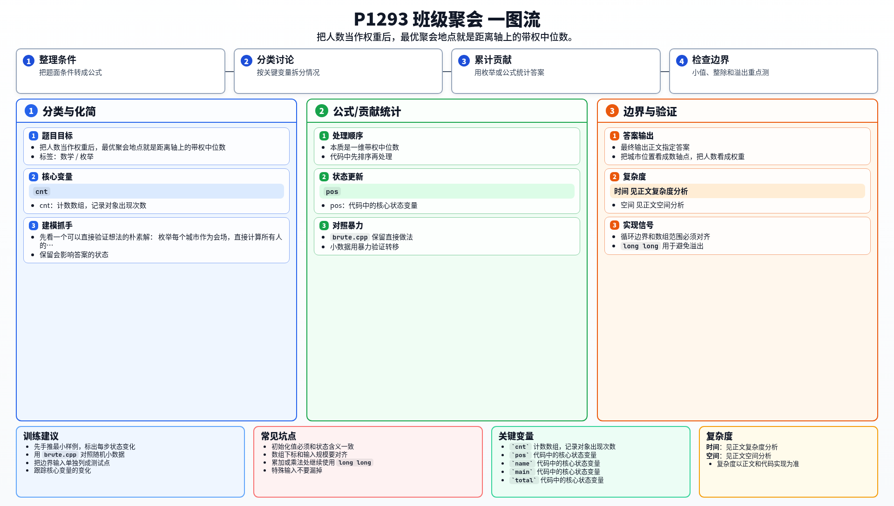

[[TOC]]

### 题意

给出若干个城市的人数、到莫斯科的距离和城市名。
要求从这些城市中选一个举办聚会，使所有同学前往该城市的总路程最小；若并列，选更靠近莫斯科的城市。

### 思路

先看一个可以直接验证想法的朴素解：

枚举每个城市作为会场，直接计算所有人的总代价。

@include-code(./brute.cpp, cpp)

这题的本质是一维带权中位数。
把城市位置看成数轴点，把人数看成权重。

按距离排序后，当前缀人数第一次达到总人数一半时，这个位置就是最优会场。
如果有多个位置都最优，最左边那个正好也满足“更靠近莫斯科优先”。

### 代码

@include-code(./main.cpp, cpp)

### 复杂度

时间复杂度 `O(n log n)`，空间复杂度 `O(n)`。

### 总结

这题的关键是把“最小化总路程”识别成带权中位数问题。

### 一图流解析

这张图把本题的建模、关键转移、实现检查和训练方法压缩到一页，适合读完正文后复盘。

