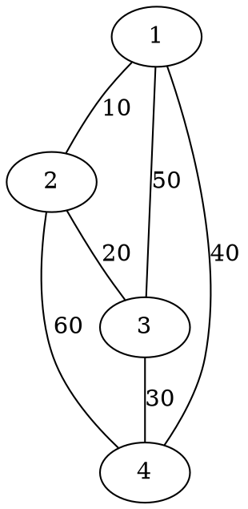
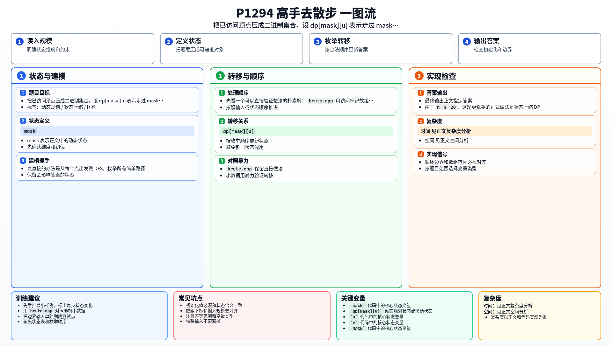

[[TOC]]

### 题意

给出一张无向带权图，可以从任意点出发、任意点结束，但同一个点不能重复经过。

要求求出能够走出的最大总路程。

### 思路

最直接的办法是从每个点出发做 DFS，枚举所有简单路径。

先看一个可以直接验证想法的朴素解：

@include-code(./brute.cpp, cpp)

`brute.cpp` 用访问标记数组直接回溯，适合小图对拍。

由于 `n <= 20`，这题更稳妥的正式做法是状态压缩 DP。把“已经走过哪些点”压成二进制集合 `mask`，设：

`dp[mask][u]`

表示当前已经访问过集合 `mask`，最后停在点 `u` 时，能够得到的最大路径长度。

这张图展示样例图的结构：

从图里可以看出，最长简单路径其实就是依次经过四个点并把三条较优边串起来。状态压缩 DP 正是在系统枚举“走过哪些点、最后停在哪”的所有可能。

初始时任意单点都能作为起点：

- `dp[1<<u][u] = 0`

如果当前在 `u`，并且边 `(u, v, w)` 存在，且 `v` 还没访问过，那么：

`dp[mask | (1<<v)][v] = max(dp[mask | (1<<v)][v], dp[mask][u] + w)`

所有状态里的最大值就是答案。

### 代码

@include-code(./main.cpp, cpp)

### 复杂度

状态数约为 `2^n * n`，每个状态沿邻边转移，总时间复杂度可以看成 `O(2^n * m)`，空间复杂度是 `O(2^n * n)`。

### 总结

这题的关键不是死搜，而是看出 `n <= 20` 适合做状态压缩。把“已访问点集 + 当前终点”作为状态后，最长简单路径就能稳定求出来。

### 一图流解析

这张图把本题的建模、关键转移、实现检查和训练方法压缩到一页，适合读完正文后复盘。

