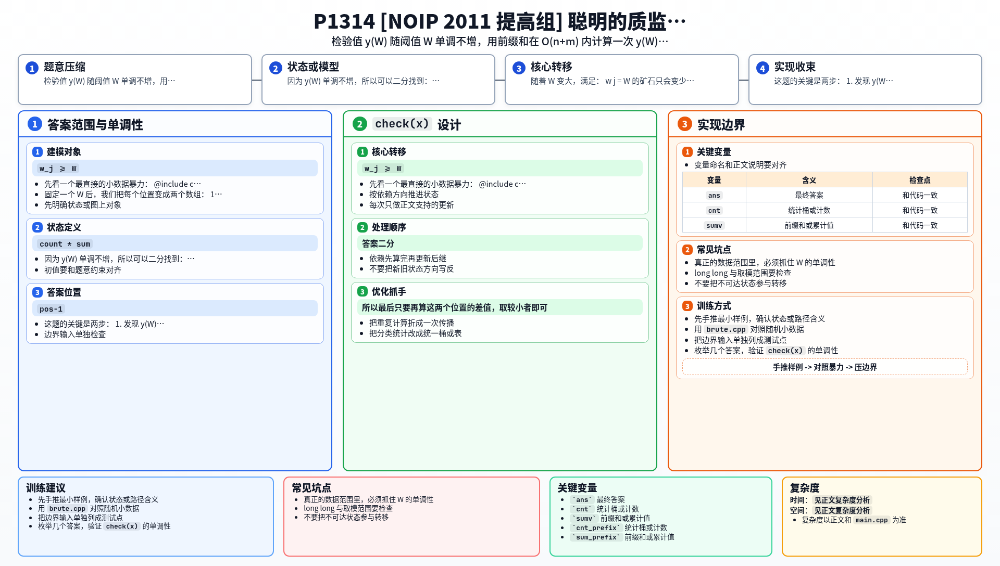

[[TOC]]

### 题意

给定 `n` 个矿石，每个矿石有：

- 重量 `w_i`
- 价值 `v_i`

再给定 `m` 个区间 `[l_i,r_i]` 和一个标准值 `s`。

选定一个阈值 `W` 后，对每个区间定义：

- 区间中满足 `w_j >= W` 的矿石个数
- 区间中这些矿石价值之和

两者相乘得到这个区间的检验值，所有区间检验值之和记作 `y(W)`。

要求选择一个 `W`，使得：

`|y(W) - s|`

最小，并输出这个最小值。

### 思路

先看一个最直接的小数据暴力：

@include-code(./brute.cpp, cpp)

`brute.cpp` 直接枚举所有可能的 `W`，再按定义把每个区间的检验值都算出来。

这个方法只适合小数据。真正的数据范围里，必须抓住 `W` 的单调性。

#### 第一步：观察 y(W) 的变化

随着 `W` 变大，满足：

`w_j >= W`

的矿石只会变少，不会变多。

所以：

- 每个区间里的“计数”不会增大
- 每个区间里的“价值和”也不会增大
- 区间检验值 `count * sum` 不会增大

因此总检验值 `y(W)` 随 `W` 单调不增。

#### 第二步：怎么快速算一次 y(W)？

固定一个 `W` 后，我们把每个位置变成两个数组：

1. `a_i = [w_i >= W]`
2. `b_i = [w_i >= W] * v_i`

然后做两组前缀和：

- `cnt_prefix`
- `sum_prefix`

这样对于任意区间 `[l,r]`：

- 满足条件的矿石个数就是 `cnt_prefix[r] - cnt_prefix[l-1]`
- 这些矿石价值和就是 `sum_prefix[r] - sum_prefix[l-1]`

区间贡献就能在 `O(1)` 算出。  
整次 `y(W)` 的计算复杂度就是 `O(n+m)`。

#### 第三步：二分最接近 s 的位置

因为 `y(W)` 单调不增，所以可以二分找到：

> 第一个满足 `y(W) <= s` 的 `W`

设这个位置是 `pos`。

那么最优答案只可能出现在：

- `W = pos`
- `W = pos - 1`

原因是：

- `pos` 是第一处掉到 `s` 以下或等于 `s` 的地方
- `pos-1` 是它前一个位置，也就是最后一个还在 `s` 上方的地方

单调函数离目标值最近的点，一定就在这个“分界点”附近。

所以最后只要再算这两个位置的差值，取较小者即可。

### 代码

@include-code(./main.cpp, cpp)

### 复杂度

- 时间复杂度：`O((n+m)\log V)`
- 空间复杂度：`O(n)`

其中 `V` 是重量的取值范围，本题里最多二分到 `max(w_i)+1`。

### 总结

这题的关键是两步：

1. 发现 `y(W)` 对 `W` 单调不增
2. 固定 `W` 时，用两组前缀和快速算出所有区间贡献

一旦把这两步接上，题目就是一个标准的“二分答案 + 前缀和统计”模型。

### 一图流解析

这张图把本题的建模、关键转移、实现检查和训练方法压缩到一页，适合读完正文后复盘。

