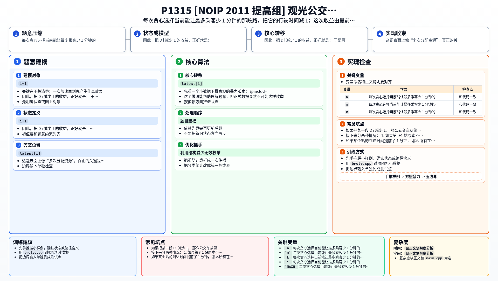

[[TOC]]

### 题意

公交车从 `1` 号景点依次开到 `n` 号景点。

第 `i` 段路原本耗时 `D_i`。
在每一站出发前，公交车都必须等这一站所有要上车的乘客到齐。

现在有 `k` 个加速器，每用一次可以让某一段 `D_i` 减少 `1`，但不能减成负数。

要求把所有乘客旅行时间总和降到最小。

### 思路

先看一个小数据下最直观的暴力版本：

@include-code(./brute.cpp, cpp)

`brute.cpp` 直接枚举每一段路到底减了多少次，再完整模拟公交时刻表。

这个做法能帮助理解题意，但正式数据显然不可能这样枚举。

关键在于想清楚：一次加速器到底产生什么效果。

如果把某一段 `D_i` 减少 `1`，
那么公交车从第 `i` 站出发后，会提前 `1` 分钟到达第 `i+1` 站。

接下来分两种情况：

1. 如果第 `i+1` 站原本不需要等乘客，那么它也会提前 `1` 分钟出发，影响继续向后传；
2. 如果第 `i+1` 站原本就要等乘客，那这 `1` 分钟提前会被等人的时间抵消，影响停止。

所以一次减 `1` 的影响范围，一定是从 `i+1` 开始的一段连续区间。

再看收益。

如果某个站的到达时间提前了 `1` 分钟，
那么所有在这个站下车的乘客，旅行时间都会减少 `1`。

因此，把 `D_i` 减少 `1` 的收益，正好就是：

```text
受影响连续区间内下车乘客数之和
```

于是可以贪心：

- 每次都选当前收益最大的那一段路去减 `1`

实现上，先重建当前时刻表：

```text
depart[i] = max(arrive[i], latest[i])
arrive[i+1] = depart[i] + D_i
```

其中 `latest[i]` 表示第 `i` 站所有上车乘客中最晚到站的时间。

接着，对每一段 `i` 求：

- 把它减 `1` 后，第 `i+1` 站会先提前 `1` 分钟
- 再看这 `1` 分钟提前从第 `i+1` 站开始最远能传到哪一站 `stop_end[i]`

这样它的收益就是：

```text
prefix_down[stop_end[i]] - prefix_down[i]
```

其中 `prefix_down` 是“每站下车人数”的前缀和。

### 代码

@include-code(./main.cpp, cpp)

### 复杂度

每次使用一个加速器，需要 `O(n)` 重建时刻表并 `O(n)` 扫一遍所有路段收益。

因此总时间复杂度是 `O(kn)`，空间复杂度是 `O(n+m)`。

### 总结

这题表面上像“多次分配资源”，真正的关键是看出：

- 一次加速器只会让后面一段连续区间整体提前 `1`
- 它的收益就是这段区间内有多少乘客下车

看清这一点以后，贪心选择当前最大收益就很自然了。


### 一图流解析

这张图把本题的建模、关键转移、实现检查和训练方法压缩到一页，适合读完正文后复盘。


