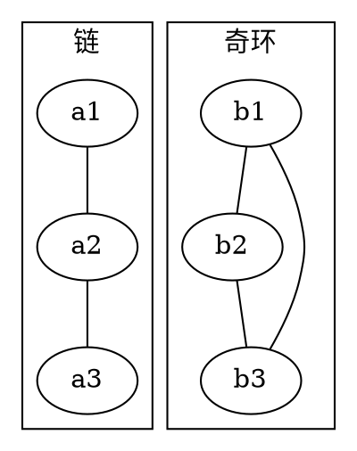

[[TOC]]

### 题意

给出一张无向图。要选出若干个点去封锁，使得：

- 每条边至少有一个端点被封锁
- 任意两个相邻点不能同时被封锁

要求封锁点数量最少；若做不到，输出 `Impossible`。

### 思路

最直接的办法是暴力枚举选哪些点。

先看一个可以直接验证想法的朴素解：

@include-code(./brute.cpp, cpp)

`brute.cpp` 直接检查每条边是否满足“恰好选一个端点”，适合小图对拍。

真正的关键是：对任意一条边 `(u, v)`，

- 如果两个端点都不选，这条边没被封锁
- 如果两个端点都选，会发生冲突

所以每条边必须恰好选一个端点。

这张图对比了两种典型情况：

从图中可以看到，链可以二分成两侧，任选一侧就能覆盖所有边；而奇环没法做到“每条边恰好跨越选与不选”，所以直接无解。

因此做法就是：

1. 对每个连通块做二分图染色
2. 若遇到相邻同色，输出 `Impossible`
3. 否则这个块只能整块选某一种颜色，答案加上 `min(cnt0, cnt1)`

### 代码

@include-code(./main.cpp, cpp)

### 复杂度

整张图只做一次 BFS 染色，所以时间复杂度是 `O(n + m)`，空间复杂度也是 `O(n + m)`。

### 总结

这题的关键是把“覆盖所有边且选中点之间不能相邻”翻译成“每条边恰好选一个端点”。一旦看出这一点，问题就直接变成二分图染色。
