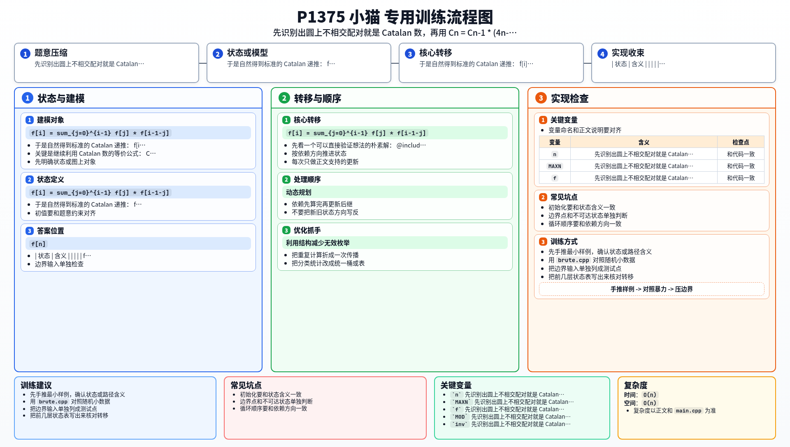

[[TOC]]

### 题意

圆上有 `2n` 只小猫，要把它们两两连线，并要求所有绳子都不能交叉。

问这样的配对方案一共有多少种，答案对 `10^9+7` 取模。

### 思路

先看一个可以直接验证想法的朴素解：

@include-code(./brute.cpp, cpp)

这个暴力固定区间最左边的点，枚举它和谁配对，然后递归处理左右两段。

于是自然得到标准的 Catalan 递推：

`f[i] = sum_{j=0}^{i-1} f[j] * f[i-1-j]`

其中 `f[i]` 表示 `i` 对点的不相交配对方案数。

但本题 `n <= 10^5`，直接做这个递推是 `O(n^2)`，过不去。

关键是继续利用 Catalan 数的等价公式：

`C_n = C_{n-1} * (4n-2) / (n+1)`

模数 `10^9+7` 是质数，所以除法可以改成乘逆元。

#### 状态表

| 状态 | 含义 |
| --- | --- |
| `f[i]` | `i` 对点的不相交配对方案数 |
| `inv[i]` | `i` 在模 `10^9+7` 下的逆元 |

于是递推写成：

`f[i] = f[i-1] * (4i-2) % MOD * inv[i+1] % MOD`

初值：

- `f[0] = 1`

答案：

- `f[n]`

### 代码

@include-code(./main.cpp, cpp)

### 复杂度

- 线性求逆元 `O(n)`
- 线性递推答案 `O(n)`
- 总时间复杂度 `O(n)`
- 空间复杂度 `O(n)`

### 总结

这题和圆上不相交连线的很多题一样，本质都是 Catalan 数。

区别只在于数据范围很大，所以不能停留在区间划分的 `O(n^2)` 递推，而要继续把它化成只依赖前一项的线性公式。

### 一图流解析

这张图把本题的建模、关键转移、实现检查和训练方法压缩到一页，适合读完正文后复盘。

