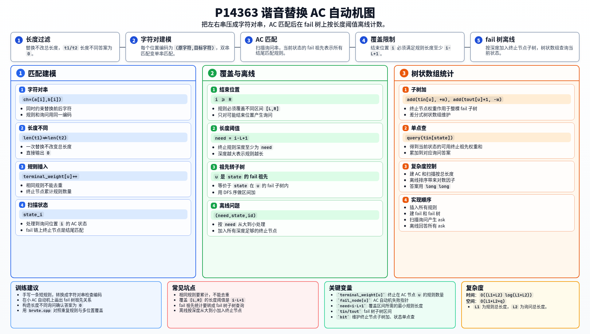

[[TOC]]

### 题意

给定 `n` 条替换规则 `(s1, s2)`，保证 `|s1| = |s2|`。一次替换可以选择原串中的一个子串，如果它等于某条规则的 `s1`，就把它替换成这条规则的 `s2`。

每个询问给出两个不同字符串 `t1, t2`，要求统计有多少种一次替换能把 `t1` 变成 `t2`。不同的替换位置或不同的规则编号都算不同方案。

### 思路

先看一个可以直接验证想法的朴素解：

@include-code(./brute.cpp, cpp)

暴力会枚举每条规则和每个起点，检查替换后是否等于目标串。它很直观，但规则总长度和询问总长度都可达 `5 * 10^6`，必须把所有规则一起匹配。

一次替换不会改变字符串总长度。所以如果 `t1` 和 `t2` 长度不同，答案一定是 `0`。

若长度相同，找到第一个和最后一个不同位置：

```text
L = first position where t1[L] != t2[L]
R = last  position where t1[R] != t2[R]
```

合法替换区间必须覆盖 `[L,R]`。区间外字符不会变化，所以所有不同位置都必须在被替换区间里面。

接着把一位上的变化 `(原字符, 目标字符)` 看成一个新的字符。比如规则 `(s1, s2)` 会变成：

```text
(s1[0], s2[0]), (s1[1], s2[1]), ...
```

询问 `(t1,t2)` 也同样变成字符对串。某条规则能在某个位置完成替换，当且仅当它的字符对串在询问字符对串中出现。

于是可以把所有规则的字符对串插入 AC 自动机。扫描询问到位置 `i` 时，当前状态的 fail 链上所有终止节点，就是所有以 `i` 结尾的规则匹配。

还需要满足覆盖 `[L,R]`。若结束位置是 `i`，则：

- 必须有 `i >= R`；
- 规则长度至少为 `i - L + 1`。

所以每个结束位置会产生一个问题：

```text
在当前 AC 状态的 fail 祖先中，统计深度至少为 i-L+1 的终止节点数量。
```

把 fail 指针看成一棵 fail 树。一个终止节点是当前状态的 fail 祖先，等价于当前状态在这个终止节点的子树中。

因此可以离线处理：

1. 把所有终止节点按深度从大到小排序；
2. 把所有询问拆出的离线问题按需要长度从大到小排序；
3. 当终止节点深度足够时，把它的整棵 fail 子树在树状数组中加上该节点的规则数量；
4. 查询当前状态的 DFS 序位置，就得到满足长度限制的终止祖先数量。

相同的规则不能去重，因为题目按二元组编号计数。代码用 `terminal_weight[u]` 记录同一个终止节点上有多少条规则。

### 代码

@include-code(./main.cpp, cpp)

### 复杂度

设规则总长度为 `L1`，询问总长度为 `L2`。

建 AC 自动机和扫描询问都是按总长度处理。离线问题数量不超过 `L2`，需要排序并用树状数组回答。

总时间复杂度可以写作：

```text
O((L1 + L2) log(L1 + L2))
```

空间复杂度为：

```text
O(L1 + L2 + q)
```

### 总结

本题的关键是把“替换前字符”和“替换后字符”合成一个字符对。这样同时检查左串和右串匹配，就变成了普通多模式串匹配。

覆盖所有不同位置 `[L,R]` 是另一个关键限制。扫描到每个可能结束位置时，只需要统计长度足够的匹配规则；这个条件可以在 fail 树上按深度阈值离线完成。

### 一图流解析

这张图把本题的建模、关键转移、实现检查和训练方法压缩到一页，适合读完正文后复盘。


