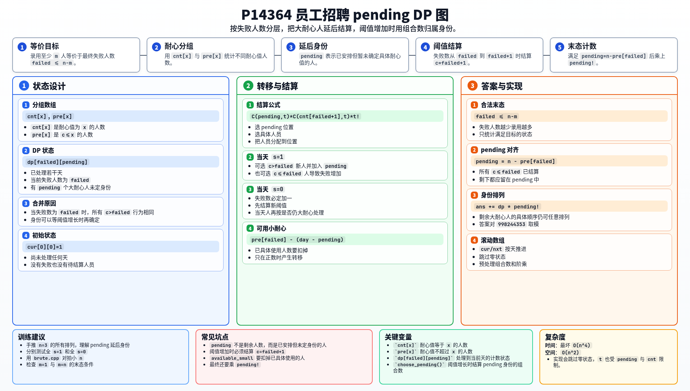

[[TOC]]

### 题意

有 `n` 个应聘者，小 Z 可以安排他们的面试顺序。第 `i` 天的题目由 `s_i` 决定：

- `s_i = 1`：参加面试的人会被录用；
- `s_i = 0`：参加面试的人会被拒绝。

每个人 `x` 有耐心上限 `c_x`。如果在他之前已经有不少于 `c_x` 人被拒绝或放弃，他会直接放弃。拒绝和放弃都会让失败人数增加。

求有多少个排列能让录用人数至少为 `m`，答案对 `998244353` 取模。

### 思路

先看一个可以直接验证想法的朴素解：

@include-code(./brute.cpp, cpp)

暴力枚举所有排列，再按题意模拟。它适合验证，但 `n <= 500` 时不能使用。

录用人数至少为 `m`，等价于最终失败人数至多 `n-m`。一个人是否放弃，只取决于当前失败人数和他的 `c`，所以可以按耐心值分组。

设：

```text
cnt[x] = c_i = x 的人数
pre[x] = c_i <= x 的人数
```

DP 的核心状态是：

```text
dp[failed][pending]
```

表示已经处理若干天后，当前失败人数为 `failed`，并且有 `pending` 个已经安排过、但还没有确定具体耐心值的人。

为什么可以“不确定具体耐心值”？因为当失败人数是 `failed` 时，所有 `c > failed` 的人行为完全相同：他们不会放弃。只有当失败人数涨到 `failed+1` 时，`c = failed+1` 的人会从“不会放弃”变成“之后会放弃”，这时才需要把他们从 `pending` 中结算出来。

当失败人数从 `failed` 变为 `failed+1` 时，假设从 `pending` 个位置中结算出 `t` 个耐心值为 `failed+1` 的人，方案数为：

```text
C(pending, t) * C(cnt[failed+1], t) * t!
```

三部分分别表示：

- 选择哪些 pending 位置属于这一组；
- 选择具体是哪 `t` 个人；
- 把这些人分配到这些位置。

接着看每天怎么转移。

如果当天 `s = 1`：

- 选一个 `c > failed` 的新人，他会被录用，失败人数不变，加入 `pending`；
- 选一个 `c <= failed` 且还没用过的人，他会放弃，失败人数增加，并结算新阈值。

如果当天 `s = 0`：

- 当天一定会产生一个失败；
- 先结算新阈值 `failed+1`；
- 再选择当天这个人：若他仍属于 `c > failed+1`，他参加面试后被拒绝，加入 `pending`；否则他立即按具体身份结算。

最后统计答案时，只保留失败人数 `failed <= n-m` 的状态。并且最终必须满足：

```text
pending = n - pre[failed]
```

也就是所有 `c <= failed` 的人已经结算完，剩下的大耐心人都还在 `pending` 里。它们的具体身份还可以任意排列，所以要乘上 `pending!`。

### 代码

@include-code(./main.cpp, cpp)

### 复杂度

滚动 DP 数组和组合数表都是 `O(n^2)` 空间。

转移中会枚举结算数量 `t`，最坏时间复杂度可写作：

```text
O(n^4)
```

实际实现会跳过零状态，并且 `t` 受 `pending` 和 `cnt[failed+1]` 限制。

### 总结

本题难点在于不能直接记录每个耐心值用了多少人。`pending` 的作用是把当前还不会放弃的人暂时合并，等失败人数增长到某个阈值时，再用组合数一次性结算对应耐心值的人。

只要把“失败人数增加”视为状态边界，整个计数过程就能按天推进。

### 一图流解析

这张图把本题的建模、关键转移、实现检查和训练方法压缩到一页，适合读完正文后复盘。


