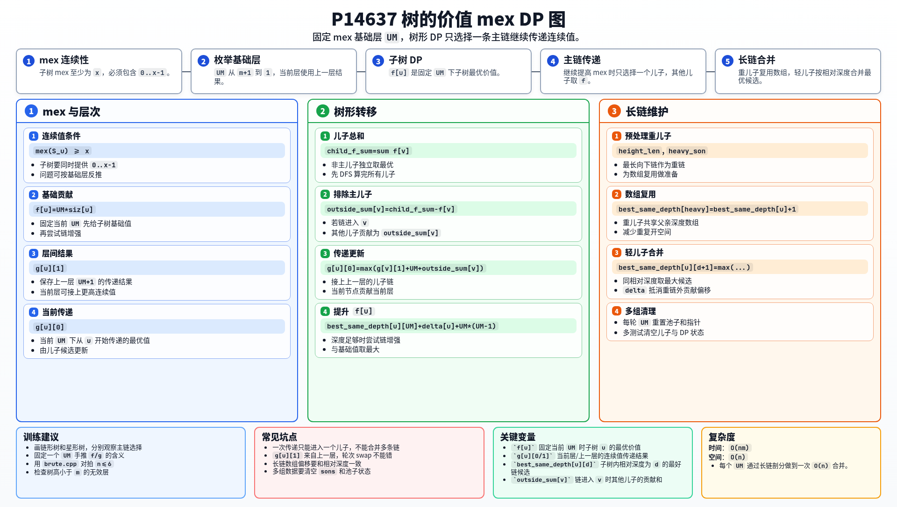

[[TOC]]

### 题意

给定一棵以 `1` 为根的有根树。需要给每个节点设置一个非负整数权值。

对节点 `i`，设 `S_i` 为它子树内所有节点权值构成的集合。树的价值为：

```text
sum mex(S_i)
```

要求在所有赋值方案中最大化这个价值。题目保证树高不超过 `m`。

### 思路

先看一个可以直接验证想法的朴素解：

@include-code(./brute.cpp, cpp)

暴力枚举每个节点的权值，再计算每个子树的 mex。它能帮助理解题意，但复杂度是指数级。

mex 的关键是连续性：如果一个子树的 mex 至少为 `x`，那么这个子树里必须同时出现 `0,1,...,x-1`。因此最优赋值可以理解为在树上安排一些连续值，让尽可能多的祖先子树获得更大的 mex。

正解按一个基础层 `UM` 从大到小做 DP。固定 `UM` 时，可以先把每个节点的贡献看作基础值，再考虑能否沿一条向下链继续把 mex 抬高。

代码中维护这些量：

- `f[u]`：当前 `UM` 下，子树 `u` 的最优价值；
- `g[u][0]`：当前 `UM` 下，从 `u` 开始继续传递连续值的最优值；
- `g[u][1]`：上一层 `UM+1` 的传递结果；
- `best_same_depth[u][d]`：在 `u` 的子树中，相对深度为 `d` 的最好传递链候选。

如果从节点 `u` 继续往某个儿子 `v` 传递，那么其他儿子就只贡献它们当前 `f` 的最优值。也就是说，每次传递只会选择一个主儿子继续往下，其余子树提供独立贡献。

为了快速合并同深度的候选，代码使用长链剖分：

- 预处理每个节点的最长向下链长度和重儿子；
- 重儿子复用父节点的深度数组；
- 轻儿子的深度信息再逐项合并到父节点数组中。

这样每一轮 `UM` 的 DFS 合并总量是 `O(n)`，外层有 `O(m)` 轮。

### 代码

@include-code(./main.cpp, cpp)

### 复杂度

外层枚举 `UM`，最多 `m+1` 轮。每轮通过长链剖分完成一次 `O(n)` 的树形 DP。

总时间复杂度为：

```text
O(nm)
```

空间复杂度为 `O(n)`。

### 总结

本题不是直接给每个节点算 mex，而是反过来考虑“要让 mex 达到某一层，需要子树里提供哪些连续值”。

固定基础层 `UM` 后，树形 DP 只需要决定哪条儿子链继续传递，其他子树取当前最优贡献。长链剖分负责把“同深度的最优链候选”高效合并起来。

### 一图流解析

这张图把本题的建模、关键转移、实现检查和训练方法压缩到一页，适合读完正文后复盘。


