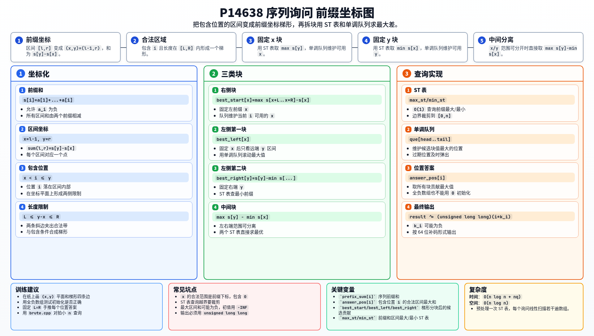

[[TOC]]

### 题意

给定长度为 `n` 的序列 `a`。每次询问给出长度范围 `[L,R]`。

对每个位置 `i`，令 `k_i` 表示所有包含 `i`、且长度在 `[L,R]` 内的子区间中，区间和的最大值。

样例输出对应的聚合方式是：

```text
(1*k_1) xor (2*k_2) xor ... xor (n*k_n)
```

使用 unsigned 64 位输出。

### 思路

先看一个可以直接验证想法的朴素解：

@include-code(./brute.cpp, cpp)

暴力会对每个位置枚举所有包含它的区间，检查长度并取最大区间和。这个做法清楚，但单个询问就可能达到二次复杂度。

设前缀和为：

```text
s[0] = 0
s[i] = a[1] + ... + a[i]
```

区间 `[l,r]` 可以写成前缀坐标：

```text
x = l - 1, y = r
sum(l,r) = s[y] - s[x]
```

它包含位置 `i`，并且长度在 `[L,R]` 内，等价于：

```text
x < i <= y
L <= y - x <= R
```

所以对固定 `i`，问题是在一个梯形区域里最大化 `s[y] - s[x]`。

代码把这个梯形拆成几个可以快速处理的块：

- 固定 `x` 后，`y` 的范围是一段区间，用 ST 表查询 `max s[y]`，再用单调队列维护当前位置可用的 `x`；
- 固定 `y` 的块类似，用 ST 表查询 `min s[x]`；
- 中间块中，`x` 和 `y` 的范围可以分开，答案就是 `max s[y] - min s[x]`。

这样每个询问只需要线性扫描若干遍数组。

### 代码

@include-code(./main.cpp, cpp)

### 复杂度

预处理前缀和的最大/最小 ST 表需要：

```text
O(n log n)
```

每个询问 `O(n)`，所以总时间复杂度为：

```text
O(n log n + nq)
```

空间复杂度为 `O(n log n)`。

### 总结

本题的关键不是直接枚举区间，而是把区间转成前缀和坐标中的点 `(x,y)`。

包含位置和长度限制共同形成一个梯形区域。把这个区域拆成几块后，每块都能用 ST 表和单调队列在线性时间内更新所有 `k_i`。

### 一图流解析

这张图把本题的建模、关键转移、实现检查和训练方法压缩到一页，适合读完正文后复盘。


