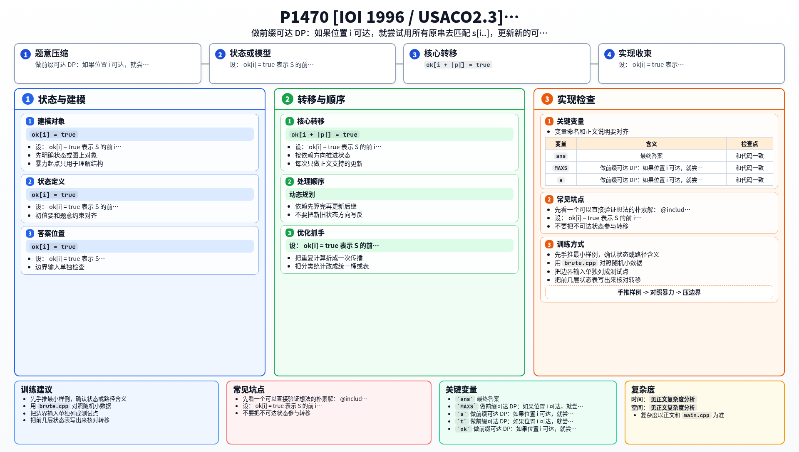

[[TOC]]

### 题意

给一组原串 `P`，可以重复使用它们来拼接。

再给一个长串 `S`，要求求出 `S` 的最长前缀长度 `k`，使得前 `k` 个字符能被这些原串拼出来。

### 思路

先看一个可以直接验证想法的朴素解：

@include-code(./brute.cpp, cpp)

最直接的想法是：

- 判断 `S` 的前 `1` 个字符能不能拼
- 判断前 `2` 个字符能不能拼
- ...

但如果每个前缀都单独做一次，会有很多重复计算。

更自然的做法是前缀 DP。

设：

- `ok[i] = true` 表示 `S` 的前 `i` 个字符可以被拼出来

初始有：

- `ok[0] = true`

然后枚举每个位置 `i`：

- 如果 `ok[i] = true`
- 就尝试把所有原串接在这个位置后面

也就是说，只要某个原串 `p` 恰好等于 `S[i..i+|p|-1]``，就可以让：

- `ok[i + |p|] = true`

因为原串数量最多 `200`，每个原串长度最多 `10`，所以这样直接枚举原串并逐字符比较就已经足够了，不需要更复杂的 KMP。

最后把所有 `ok[i] = true` 的位置里最大的 `i` 输出即可。

### 代码

@include-code(./main.cpp, cpp)

### 复杂度

设长串长度为 `n`，原串数量为 `m`，单个原串最大长度为 `L`。

总复杂度大约是 `O(n * m * L)`。

由于这里 `m <= 200`，`L <= 10`，可以通过。

### 总结

这题看起来像字符串匹配题，但本质更像“可达位置 DP”。

关键点是：

- 不是求某个模式串出现位置
- 而是判断前缀能不能被一组短串拼出来

所以前缀 DP 比 KMP 更直接。

### 一图流解析

这张图把本题的建模、关键转移、实现检查和训练方法压缩到一页，适合读完正文后复盘。

