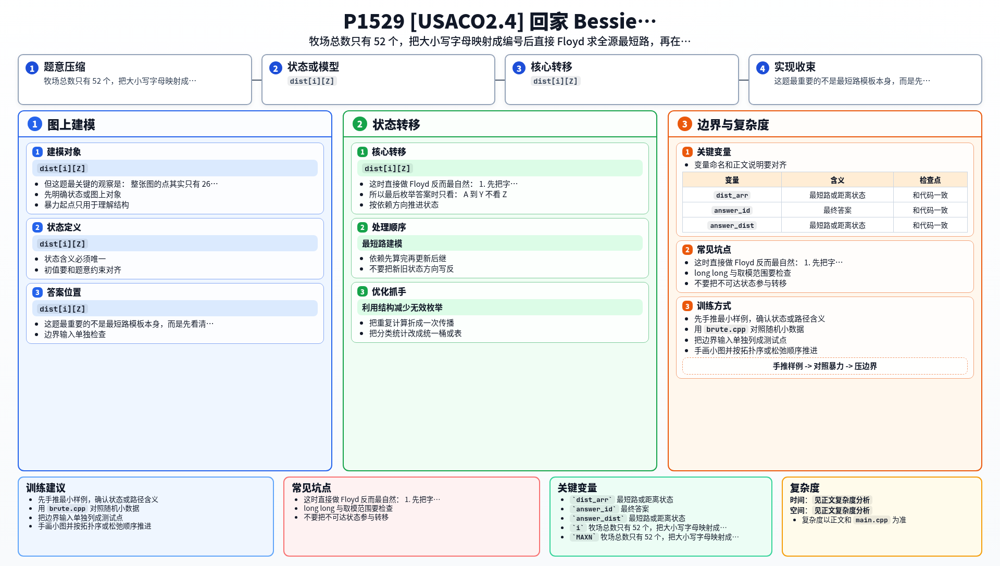

[[TOC]]

### 题意

牧场用字母表示：

- `a..z`
- `A..Y`
- `Z`

其中：

- 大写 `A..Y` 上各有一头牛
- `Z` 是谷仓
- 小写字母上没有牛

给若干条无向边和边权。  
所有牛都要走最短路回到 `Z`。

要求输出：

1. 最先回到谷仓的那头牛所在的大写牧场字母
2. 它到 `Z` 的最短路长度

### 思路

先看一个最直接的小数据暴力：

@include-code(./brute.cpp, cpp)

暴力做法是：

1. 对每个大写牧场 `A..Y` 单独跑一次 Dijkstra
2. 看谁到 `Z` 最近

这个做法已经可以过小数据，也很好理解。

但这题最关键的观察是：

- 整张图的点其实只有 `26 + 26 = 52` 个

也就是说，虽然输入看起来像字符串图，但本质上只是一个很小的图。  
这时直接做 Floyd 反而最自然：

1. 先把字符映射成 `0..51` 的编号
2. 建一个 `52 x 52` 的距离矩阵
3. Floyd 求任意两点最短路
4. 枚举所有有牛的大写点 `A..Y`，找 `dist[i][Z]` 最小的那个

这里要注意两点：

#### 1. 大小写是不同的点

`m` 和 `M` 不是同一个牧场，所以必须分开编号。

#### 2. 只有 `A..Y` 上有牛

`Z` 是谷仓，没有牛在 `Z` 上。  
所以最后枚举答案时只看：

- `A` 到 `Y`

不看 `Z`。

### 代码

@include-code(./main.cpp, cpp)

### 复杂度

Floyd 的时间复杂度：

- `O(52^3)`

这在本题里就是一个很小的常数。

空间复杂度：

- `O(52^2)`

### 总结

这题最重要的不是最短路模板本身，而是先看清楚：

- 点数其实只有 52

一旦意识到图很小，Floyd 就是最顺手的写法。  
所以这是一个很典型的“先估点数，再选最短路算法”的题。

### 一图流解析

这张图把本题的建模、关键转移、实现检查和训练方法压缩到一页，适合读完正文后复盘。

