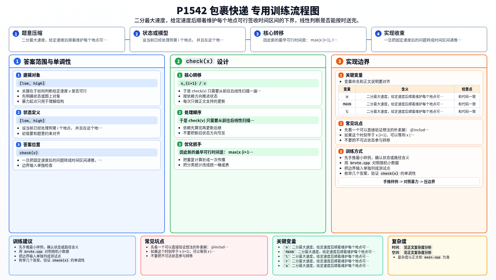

[[TOC]]

### 题意

有 `n` 个地点需要按顺序依次送达。

第 `i` 个地点给出：

- 可签收时间区间 `[x_i, y_i]`
- 从前一个地点到这里的距离 `s_i`

小 K 可以在某个地点提前到达并等待，
但不能晚于该地点的签收上界。

要求最小化整条路线允许使用的最大速度。

### 思路

先看一个可以直接验证想法的朴素解：

@include-code(./brute.cpp, cpp)

这题答案有很明显的单调性：

- 如果某个速度可行，更大的速度也一定可行；
- 如果某个速度不可行，更小的速度也一定不可行。

所以整体框架是二分答案。

关键在于如何判断给定速度 `v` 是否可行。

设当前已经处理到第 `i` 个地点，
并且在这个地点能够合法完成签收的时间范围是 `[low, high]`。

到下一个地点至少要花：

- `s_{i+1} / v`

所以最早只能在：

- `low + s_{i+1} / v`

时到达第 `i+1` 个地点。

如果这个时刻早于 `x_{i+1}`，可以等到 `x_{i+1}`；
如果它晚于 `y_{i+1}`，就说明这个速度不够快。

因此新的最早可行时间是：

- `max(x_{i+1}, low + s_{i+1}/v)`

只要这个值不超过 `y_{i+1}`，就还能继续。

于是 `check(v)` 只需要从前往后线性扫描一遍地点，
不断更新这个“当前最早可行签收时间”即可。

### 代码

@include-code(./main.cpp, cpp)

### 复杂度

每次判定 `O(n)`，
二分固定迭代若干次，
总复杂度可视为 `O(n)`。

### 总结

这题本质上不是路径规划，而是“速度够不够快”的可行性判定。

一旦把固定速度后的问题转成时间区间递推，
整题就是标准的“二分答案 + 线性 check”。

### 一图流解析

这张图把本题的建模、关键转移、实现检查和训练方法压缩到一页，适合读完正文后复盘。

