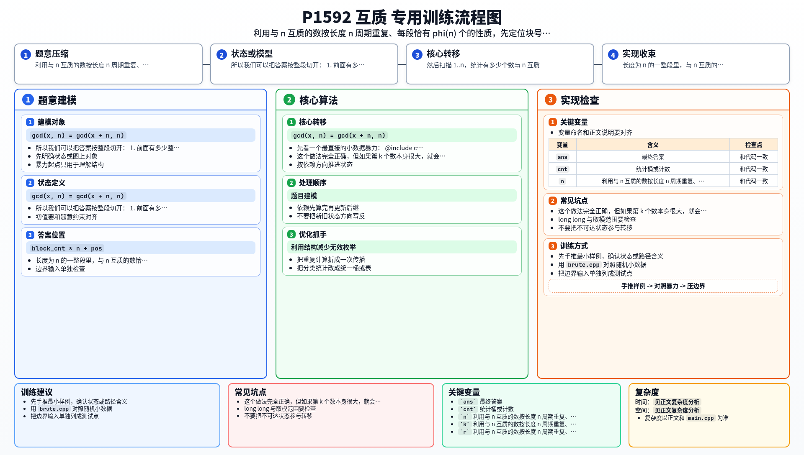

[[TOC]]

### 题意

给定两个正整数 `n,k`，要求输出按从小到大排列时，第 `k` 个与 `n` 互质的正整数。

### 思路

先看一个最直接的小数据暴力：

@include-code(./brute.cpp, cpp)

`brute.cpp` 从 `1` 开始一个一个枚举正整数，只要和 `n` 的最大公约数是 `1`，就把它计入答案。

这个做法完全正确，但如果第 `k` 个数本身很大，就会枚举很多整数，不适合大数据。

#### 关键观察：按 `n` 为长度，分布会周期重复

对于任意整数 `x`：

`gcd(x, n) = gcd(x + n, n)`

因为 `x+n` 和 `x` 对 `n` 取模后的余数相同。

这说明：

- 在区间 `1..n` 中哪些数和 `n` 互质
- 和在区间 `n+1..2n` 中哪些数和 `n` 互质
- 以及后面每一段长度为 `n` 的区间

它们的相对位置完全一样。

#### 每一段里有多少个？

长度为 `n` 的一整段里，与 `n` 互质的数恰好有：

`phi(n)`

个，这里 `phi(n)` 就是欧拉函数。

所以我们可以把答案按整段切开：

1. 前面有多少整段已经完整跳过
2. 当前这一段里，要找第几个与 `n` 互质的数

设：

- `block_cnt = (k - 1) / phi(n)`
- `need = (k - 1) % phi(n) + 1`

那么答案一定是：

- 前面先跳过 `block_cnt` 段，每段长度都是 `n`
- 再在 `1..n` 中找到第 `need` 个与 `n` 互质的数

最后答案就是：

`block_cnt * n + pos`

其中 `pos` 表示 `1..n` 中第 `need` 个与 `n` 互质的位置。

#### 实现细节

先用试除法计算 `phi(n)`。

然后扫描 `1..n`，统计有多少个数与 `n` 互质。  
当数到第 `need` 个时，就可以直接得到最终答案。

### 代码

@include-code(./main.cpp, cpp)

### 复杂度

- 时间复杂度：`O(sqrt(n) + n log n)`
- 空间复杂度：`O(1)`

### 总结

这题的核心不是一直往后枚举，而是发现“与 `n` 互质”的分布会按长度 `n` 周期重复。

再结合每段恰好有 `phi(n)` 个合法数，就能把“第 `k` 个”转成：

1. 先算它落在哪一段
2. 再算它在这一段里的第几个位置

这样复杂度就降下来了。

### 一图流解析

这张图把本题的建模、关键转移、实现检查和训练方法压缩到一页，适合读完正文后复盘。

