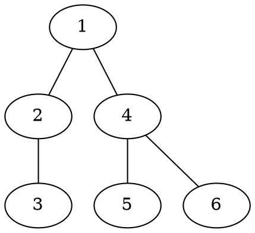

[[TOC]]

### 题意

树上有 `m` 个玩家，每个人都会从起点 `s_i` 同时出发，沿最短路径跑到终点 `t_i`，速度是每秒走一条边。

点 `j` 上有一个观察员，他只会在第 `w_j` 秒看一次。

如果某个玩家恰好在第 `w_j` 秒到达点 `j`，那么这个观察员就能看到他。

要求输出每个点最终能看到多少个玩家。

#### 样例图

样例一的树结构是：

比如玩家 `1 -> 5`：

- 第 `0` 秒在 `1`
- 第 `1` 秒到 `4`
- 第 `2` 秒到 `5`

所以如果某个点的观察时间正好是这些时刻，它就能看到这名玩家。

### 思路

先看一个最直接的小数据暴力：

@include-code(./brute.cpp, cpp)

暴力做法就是：

1. 对每个玩家，真的沿路径一格一格往终点跑
2. 记录他在每个点的到达时间
3. 如果这个时间等于观察员时间，就给该点答案加一

这个方法非常直观，但显然不可能在大数据下对每个玩家都把整条路径走一遍。

关键观察是：  
对一条路径 `s -> t`，设 `l = lca(s, t)`，路径可以拆成两段：

1. `s -> l` 的上升段
2. `l -> t` 的下降段

对于某个点 `u`：

#### 1. 如果 `u` 在上升段上

玩家到达 `u` 的时间就是：

`depth[s] - depth[u]`

所以满足被观察到的条件是：

`depth[s] = depth[u] + w[u]`

也就是说，我们只需要统计：

- 有多少条路径的起点深度等于 `depth[u] + w[u]`
- 并且这条路径的上升段经过了 `u`

对一条路径来说，上升段恰好覆盖从 `s` 到 `l` 这条链。  
这很像树上差分：

- 在 `s` 挂一个 `+1`
- 在 `parent(l)` 挂一个 `-1`（如果 `l` 不是根）

这样在后序汇总时，某个点 `u` 子树里留下来的这一类计数，就正好对应“有哪些上升段会经过 `u`”。

#### 2. 如果 `u` 在下降段上（不含 lca）

这时玩家先从 `s` 走到 `l`，再从 `l` 走到 `u`，时间是：

`depth[s] - depth[l] + depth[u] - depth[l]`

整理成：

`depth[s] - 2 * depth[l] + depth[u]`

所以条件变成：

`depth[s] - 2 * depth[l] = w[u] - depth[u]`

于是又变成了另一类“值相等”统计。

同理，下降段只覆盖 `(l, t]` 这一段，所以事件挂法变成：

- 在 `t` 挂一个 `+1`
- 在 `l` 挂一个 `-1`

因为 `l` 本身不属于下降段，所以要在 `l` 这里截断。

整题的核心就是把这两类条件分开统计：

- 第一类桶：按 `depth[s]` 统计
- 第二类桶：按 `depth[s] - 2*depth[lca]` 统计

接下来做一次非递归后序 DFS。  
对于每个点 `u`：

1. 进入 `u` 子树前，先记下两个桶在目标位置上的旧值
2. 退出 `u` 时，把 `u` 自己挂的事件加入桶
3. 再读一次两个桶
4. 新旧两次读数的差值，就是 `u` 子树对 `u` 的有效贡献

这样在处理到节点 `u` 时：

- 第一类桶里 `depth[u] + w[u]` 的数量
- 加上第二类桶里 `w[u] - depth[u]` 的数量

就是答案。

这题还有一个工程细节非常重要：

- 数据会卡递归深度

所以正式代码里，建树、LCA、以及最后的后序 DFS 都改成了非递归写法。

### 代码

@include-code(./main.cpp, cpp)

### 复杂度

预处理：

- 倍增 LCA：`O(n log n)`

每个玩家只会在两类事件表里各挂常数个事件，所以：

- 事件总数 `O(m)`

最后一次后序 DFS 汇总：

- `O(n + m)`

总复杂度：

- `O((n + m) log n)`（主要花在求每条路径的 LCA）

空间复杂度：

- `O(n log n + m)`

### 总结

这题最容易卡住的地方，是直接去想“某个玩家什么时候到某个点”，会把自己带进一堆路径细节里。

真正有效的拆法是：

1. 先按 `lca` 把路径拆成上升段和下降段
2. 把到达时间分别改写成两种线性形式
3. 再用树上差分 + 桶统计统一离线处理

所以本质上它是一道：

- `LCA`
- `树上差分`
- `离线计数`

的综合题。 
