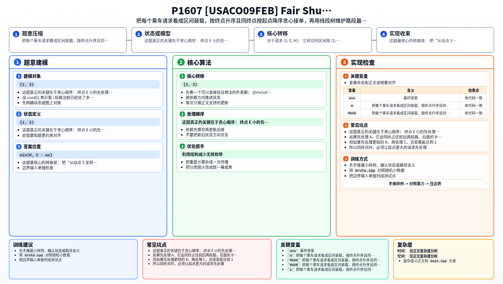

[[TOC]]

### 题意

车从 `1` 号站一路开到 `N` 号站，只走一遍，容量是 `C`。

有 `K` 个请求 `(S, E, M)`，表示最多有 `M` 头牛想从 `S` 坐到 `E`。
一批牛允许只接其中一部分。

要求输出最多一共能运多少头牛。

把相邻两站之间的一段路看成一个位置，那么请求 `(S, E, M)` 就会同时占用区间 `[S, E-1]` 上的所有位置。

### 思路

先看一个可以直接验证想法的朴素解：

@include-code(./brute.cpp, cpp)

`brute.cpp` 直接枚举每个请求到底接多少头牛，并维护每一段路的占用情况。
它是精确解，但只能用于小数据对拍，因为状态数会随着请求数快速爆炸。

这题真正的关键在于贪心顺序：

- 终点 `E` 小的先处理
- 如果终点相同，起点 `S` 大的先处理

同终点的第二条很重要，这张表展示了一个反例：

| 请求 | 区间 | 数量 |
| --- | --- | --- |
| A | `[1, 3)` | `1` |
| B | `[2, 3)` | `1` |
| C | `[1, 2)` | `1` |

车容量设为 `1`。
如果先处理 `A`，它会同时占住前后两段路，后面的 `B` 和 `C` 最多只能再选一个，总答案只有 `1`。
但如果先处理更短的 `B`，再处理 `C`，总答案能达到 `2`。
所以同终点时，必须让起点更大的请求先处理。

顺序确定后，处理当前请求时就应该尽量多接。
因为每头牛贡献都一样，而当前请求在贪心顺序里优先级最高，没必要故意留容量给更晚结束或更长的请求。

设 `used[i]` 表示第 `i` 段路当前已经坐了多少头牛。
对于请求 `(S, E, M)`：

- 它经过的区间是 `[S, E-1]`
- 这段区间里最满的一段若为 `mx`
- 那么这次最多还能接 `min(M, C - mx)` 头牛

于是问题变成了标准的两件事：

- 区间最大值查询
- 区间整体加法修改

用懒标记线段树维护即可。

### 代码

@include-code(./main.cpp, cpp)

### 复杂度

排序复杂度是 `O(K log K)`。

之后每个请求需要一次区间最大值查询和最多一次区间加法修改，所以总时间复杂度是 `O(K log N)`。

线段树空间复杂度是 `O(N)`。

### 总结

这题最核心的转换是：

- 把“从站点 `S` 坐到 `E`”变成“占用路段区间 `[S, E-1]`”

然后抓住两个关键点：

- 按终点升序贪心
- 同终点按起点降序

最后再用线段树把“区间最满路段”和“整段加人”维护起来，整题就完成了。

### 一图流解析

这张图把本题的建模、关键转移、实现检查和训练方法压缩到一页，适合读完正文后复盘。

