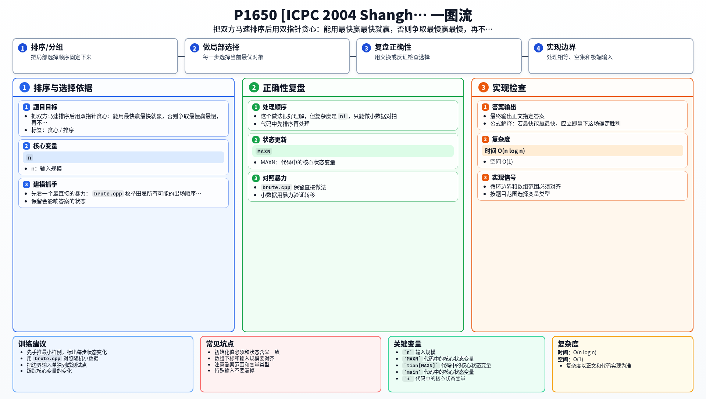

[[TOC]]

### 题意

田忌和齐王各有 `n` 匹马，每匹马只能出场一次。

每场比赛：

- 田忌更快，得 `200`
- 齐王更快，失 `200`
- 一样快，得 `0`

要求安排田忌的出场顺序，使总收益最大。

### 思路

先看一个最直接的暴力：

@include-code(./brute.cpp, cpp)

`brute.cpp` 枚举田忌所有可能的出场顺序，然后逐场和齐王比较，最后取最大得分。

这个做法很好理解，但复杂度是 `n!`，只能做小数据对拍。

关键做法是先把双方马速都排序，然后只盯住两端：

- 最快的马
- 最慢的马

设：

- `tl, tr` 表示田忌当前最慢 / 最快
- `kl, kr` 表示齐王当前最慢 / 最快

每一步分三种情况：

1. **田忌最快能赢齐王最快**  
   那这场胜利必须立刻拿下，直接让两匹最快的马对决

2. **否则，田忌最慢能赢齐王最慢**  
   那也应立刻兑现这场胜利

3. **否则**  
   田忌无法避免吃亏，就用自己最慢的马去消耗齐王最快的马  
   如果会输，就只亏这一场；如果能平，也不会更差

#### 决策表

这张表概括双指针每一步的选择：

| 条件 | 选择 |
| --- | --- |
| `tian[tr] > king[kr]` | 最快打最快 |
| 否则若 `tian[tl] > king[kl]` | 最慢打最慢 |
| 否则 | 最慢去消耗对方最快 |

#### 贪心决策公式

排序后维护田忌区间 $[tl,tr]$ 和齐王区间 $[kl,kr]$。每一步按下面的决策取收益：

$$
\begin{cases}
ans\leftarrow ans+200,\ tr--,\ kr--, & tian_{tr}>king_{kr},\\
ans\leftarrow ans+200,\ tl++,\ kl++, & tian_{tl}>king_{kl},\\
ans\leftarrow ans-200\cdot [tian_{tl}<king_{kr}],\ tl++,\ kr--, & \text{otherwise}.
\end{cases}
$$

其中 $[condition]$ 为条件成立时取 $1$，否则取 $0$。

公式解释：若最快能赢最快，应立即拿下这场确定胜利；否则若最慢能赢最慢，也应拿下不浪费强马。两者都不行时，只能用最慢马消耗对方最快马，把损失控制到最小。

### 代码

@include-code(./main.cpp, cpp)

### 复杂度

- 时间复杂度：`O(n log n)`
- 空间复杂度：`O(1)` 额外空间（不计输入数组）

### 总结

这题的关键是：胜利能拿就立即拿，拿不到时就把损失压到最小。

排序后用双指针维护两端，整个贪心过程就非常自然。

### 一图流解析

这张图把本题的建模、关键转移、实现检查和训练方法压缩到一页，适合读完正文后复盘。

