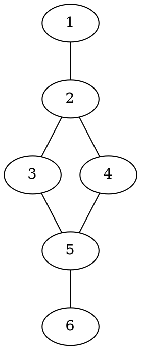
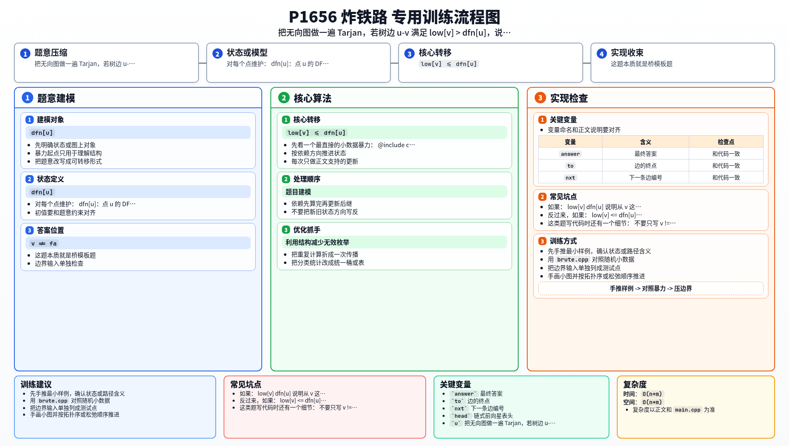

[[TOC]]

### 题意

给一张无向连通图，要求找出所有满足下面条件的边：

- 删除这条边后，图会变得不连通

题目把这样的边叫做 `key road`。

输出所有这样的边，按端点从小到大、再按字典序排序。

#### 样例图

这张图把样例画成无向图：

从图中可以看到：

- 删掉 `1-2` 后，点 `1` 会被单独隔开
- 删掉 `5-6` 后，点 `6` 会被单独隔开

所以答案是：

`1 2`

`5 6`

### 思路

先看一个最直接的小数据暴力：

@include-code(./brute.cpp, cpp)

暴力做法很直观：

1. 枚举每一条边
2. 假装把它删掉
3. 重新做一次 DFS/BFS 看图是否还连通

这个方法好理解，但每删一条边都要重跑一遍搜索，总复杂度太高。

正式做法就是 Tarjan 求桥。

对每个点维护：

- `dfn[u]`：点 `u` 的 DFS 访问次序
- `low[u]`：从 `u` 出发，沿 DFS 树边向下走、再最多走一条返祖边，能回到的最早时间戳

设在 DFS 树里有一条树边 `u -> v`。

如果：

`low[v] > dfn[u]`

说明从 `v` 这棵子树出发，完全没有办法绕路回到 `u` 或 `u` 的祖先。
那么一旦删掉边 `u-v`，`v` 这整棵子树就和外部断开了，所以它就是桥。

反过来，如果：

`low[v] <= dfn[u]`

说明 `v` 子树里至少还能通过某条返祖边绕回去，那么删掉 `u-v` 后图仍然连通，这条边不是桥。

这类题写代码时还有一个细节：

- 不要只写 `v != fa` 来跳过父边

因为无向图里可能有重边。更稳妥的写法是记录“进入当前点的是哪一条边”，遍历时只跳过它的反向边。这样即使两个点之间有多条边，也不会误判桥。

### 代码

@include-code(./main.cpp, cpp)

### 复杂度

设点数为 `n`，边数为 `m`。

Tarjan 只会把每条边访问常数次，所以：

- 时间复杂度 `O(n+m)`
- 空间复杂度 `O(n+m)`

### 总结

这题本质就是桥模板题。真正要记住的是判断式：

`low[v] > dfn[u]`

它表示 `v` 子树没有任何后路能回到 `u` 以上，因此 `u-v` 就是割边。

### 一图流解析

这张图把本题的建模、关键转移、实现检查和训练方法压缩到一页，适合读完正文后复盘。

