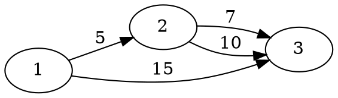
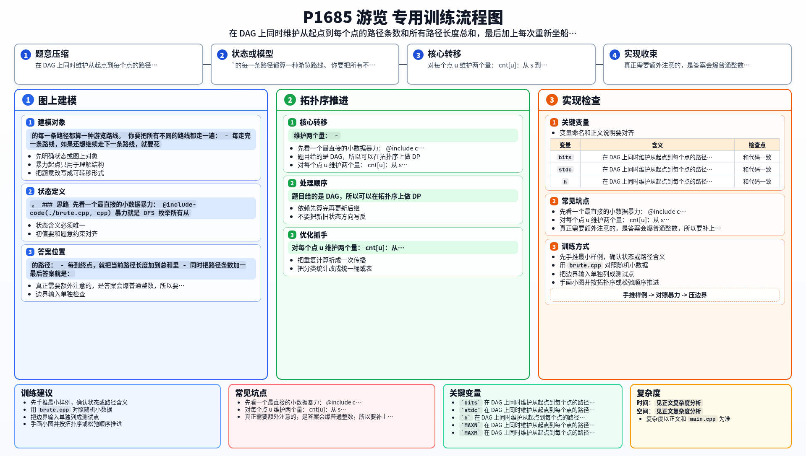

[[TOC]]

### 题意

给一张没有环的有向图，从起点 `s` 走到终点 `t` 的每一条路径都算一种游览路线。

你要把所有不同的路线都走一遍：

- 每走完一条路线，如果还想继续走下一条路线，就要花 `t0` 的时间从东头坐船回到西头
- 最后一条路线走完后直接离开，不需要再回去

问把所有不同路线都游览完，一共要花多少时间。

注意题目允许重边，因此即使经过的点相同，只要走的是不同的边，也算不同路线。

#### 样例图

这张图展示样例里的 3 条路径：

三条路线的长度分别是 `12`、`15`、`15`，总和为 `42`。
前两次游览结束后还要各坐一次船回到起点，所以再加 `2 * 7`。
因此答案是 `42 + 14 = 56`。

### 思路

先看一个最直接的小数据暴力：

@include-code(./brute.cpp, cpp)

暴力就是 DFS 枚举所有从 `s` 到 `t` 的路径：

- 每到终点，就把当前路径长度加到总和里
- 同时把路径条数加一

最后答案就是：

`所有路径长度之和 + (路径条数 - 1) * t0`

这个思路很直观，但如果路径很多，就不能真的一条一条枚举。

题目给的是 DAG，所以可以在拓扑序上做 DP。

对每个点 `u` 维护两个量：

- `cnt[u]`：从 `s` 到 `u` 的路径条数
- `sum[u]`：从 `s` 到 `u` 的所有路径长度总和

如果有一条边 `u -> v`，边权是 `w`，那么：

- 所有到 `u` 的路径都能接到 `v`
- 新增到 `v` 的路径条数正好是 `cnt[u]`
- 这些新路径的总长度，等于原来的 `sum[u]` 再加上每条路径多出来的一段 `w`

所以转移是：

- `cnt[v] += cnt[u]`
- `sum[v] += sum[u] + cnt[u] * w`

最后：

- `sum[t]` 是所有路线本身的长度总和
- `cnt[t] - 1` 是需要坐船返回的次数

于是答案就是：

`sum[t] + (cnt[t] - 1) * t0`

因为路径条数可能非常大，`long long` 不够，所以代码里用了一个只支持：

- 高精加法
- 高精乘整数

的简化高精整数类，已经足够覆盖这题需要的运算。

### 代码

@include-code(./main.cpp, cpp)

### 复杂度

设点数为 `n`，边数为 `m`。

- 拓扑 DP 主流程是 `O(n + m)`
- 每次高精运算的代价与当前数字位数成正比

因此总复杂度可以理解为 `O((n + m) * L)`，其中 `L` 是高精整数的位数。

### 总结

这题的关键不是“把所有路径枚举出来”，而是看出：在 DAG 上，路径条数和路径长度总和都可以一起按拓扑序转移。真正需要额外注意的，是答案会爆普通整数，所以要补上高精。

### 一图流解析

这张图把本题的建模、关键转移、实现检查和训练方法压缩到一页，适合读完正文后复盘。

